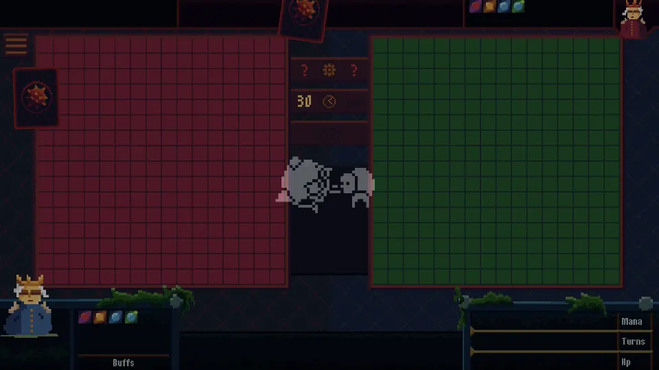
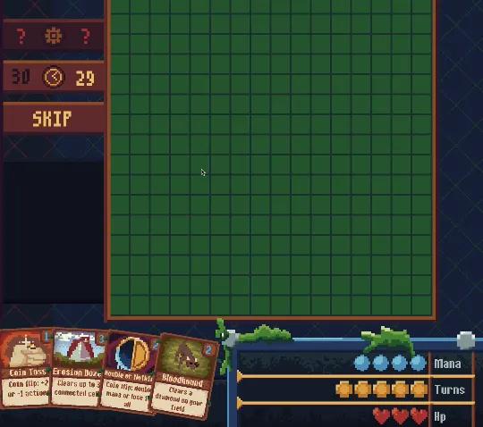
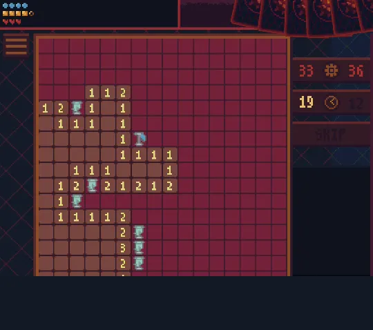
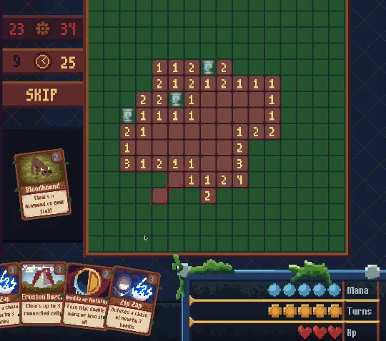

# Mines Leader

**[Play in the browser](https://minesleader.xyz/)**

Two-player competitive minesweeper with cards. Each player clears a 16×16 field with 40 mines. A turn gives you 5 actions: open a cell or play a card. Cards cost mana. Some clear or scan your own field, others drop mines, smoke, or frost on the opponent's field, and a third group works on hands, decks, and mana. The game has 51 cards.

You win when the opponent loses 3 HP to mines, runs out of time, or when you flag every mine on your field. PvP comes in two timed modes: a personal 120 s time bank, or 30 s per turn. A server-side bot covers practice matches. The client ships as a Unity WebGL build and runs in the browser.



Your field sits next to your opponent's. You both dig at the same time, and you see every move they make.



Cards replace guesswork. Drop Bloodhound on a spot you can't read, and it clears the whole diamond, mines included. Playback is 2×.



Watch your opponent aim and track how close they are to finishing. Pick your moment to bury their field in mines or smoke. Playback is 2×.



Stack cards into one turn. Zip Zap defuses a chain of mines, and one good click cascades open a corner of the board. Playback is 2×.

## Stack

| Layer | Tech |
|---|---|
| Client | Unity 6 (6000.7), C#, URP 2D, UniTask, Addressables, WebGL |
| Backend | .NET 10, Orleans 10.3, PostgreSQL (Npgsql, ADO.NET) |
| Shared | C# project compiled by both sides, MemoryPack |
| Orchestration | .NET Aspire 13.5, Docker Compose, nginx, Coolify |
| Admin | Blazor console (BlazorBlueprint) |

## Technical decisions

**Server-authoritative gameplay.** The client sends actions (open, flag, play card) over WebSocket. The game session on the server validates them, runs the board and card effects, checks win conditions, and pushes property updates back. The bot plays through the same session code as a regular user with a deck.

**One shared codebase.** `shared/` holds the protocol, board and card models, and configs. Unity imports it as a local package, and the backend references it as a csproj. MemoryPack union types serialize every message.

**Two connections per client.** A meta socket lives for the whole session and carries auth, matchmaking, and user projections (profile, rating, progression). A game socket opens for each match.

**Custom transactions on Orleans.** `ITransactions` collects state changes from every grain touched inside a call, writes them to PostgreSQL in one DB transaction, then calls `OnSuccess` or `OnFailure` on each grain. States live as versioned JSONB with migrations on read. Match end updates 7 states atomically: the match, plus rating, progression, and history for both players. Side effects commit with the states and a worker runs them afterwards (outbox).

**Grain-based messaging.** Three primitives cover service communication:
- `DurableQueue`: at-least-once delivery, syncs in-memory state collections.
- `RuntimePipe`: request/response with a timeout. Meta asks Game to create a match session through it.
- `RuntimeChannel`: pub/sub for user projections and live config updates.

**Deploy epochs.** Each coordinator start generates a `DeployId`, and all ephemeral cluster state keys off it. Services fetch the id through a pipe before they start, and resubscribe when it changes. A restart gives you a clean cluster without wiping the database.

**Generated DI container.** The client uses its own container. A Roslyn generator emits a sealed container class per scope at compile time, with no reflection at runtime. Scopes chain Internal → Global → Meta → GameLoop → Menu / GamePlay. VContainer stays in the tests as a benchmark baseline.

**Small WebGL build.** The repo embeds URP, uGUI, and RP Core and patches their asmdefs so the linker drops UI Toolkit, Physics, and XR modules. Together with removing Input System, this took the brotli build from 8.0 MB to 6.0 MB.

## Layout

```
backend/   Orleans silo, gateways, coordinator, Aspire host, tests, benchmarks
client/    Unity project
shared/    protocol, game models, configs
docs/      design notes (Obsidian, Russian) and media
```
