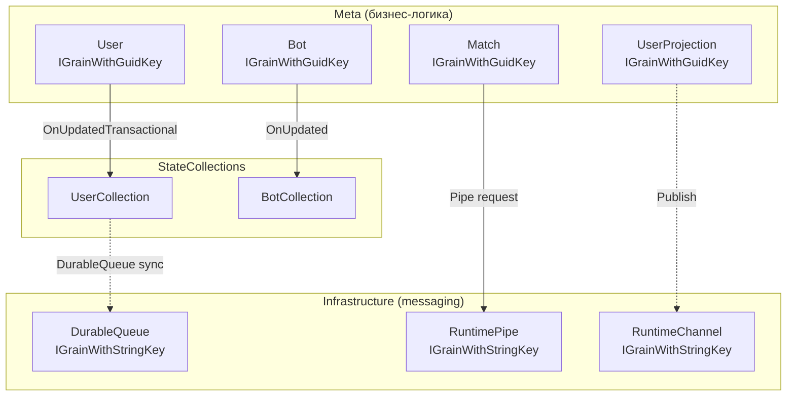
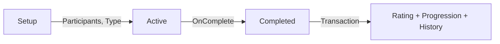
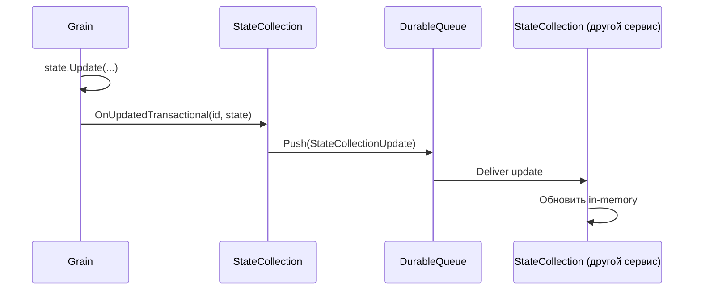

# Orleans грейны

## Обзор грейнов



---

## Бизнес-грейны

### User
Основной грейн пользователя. Наследуется от `UserGrain` и содержит под-грейны:

| Под-грейн | Интерфейс | Стейт | Назначение |
|-----------|-----------|-------|-----------|
| User | `IUser` | `UserState` | Профиль (Id, Name) |
| UserAuth | `IUserAuth` | `UserAuthState` | Авторизация (IsExists, RegisteredAt) |
| UserProgression | `IUserProgression` | `UserProgressionState` | Опыт (Records[]) |
| UserRating | `IUserRating` | `UserRatingState` | Рейтинг (Records[]) |
| UserDeck | `IUserDeck` | `UserDeckState` | Колоды (Entries{}, SelectedIndex) |
| UserMatchHistory | `IUserMatchHistory` | `UserMatchHistoryState` | История (Matches[]) |

Все методы помечены `[Transaction]` — изменения пользователя атомарны.

### UserProjection
Управляет реалтайм-обновлениями для подключённого клиента.

- `OnConnected()` / `OnDisconnected()` — отслеживание подключения
- `SendCached()` — отправка кешированных данных
- `ForceNotify()` — принудительное обновление
- Публикует через `RuntimeChannel` с per-user ID

### Match
Жизненный цикл матча:



Стейт: `MatchState` (Id, Type, Winner, Duration, Participants, Decks, RatingChanges)

### Bot
Минимальный грейн для бот-сущности. Стейт: `BotState` (Id). Обновляет `IBotCollection` при изменениях.

---

## Infrastructure-грейны

### DurableQueue
Надёжная очередь сообщений для синхронизации `StateCollection`.

- Ключ: string (например, `StateCollectionDurableQueueId<TKey, TValue>`)
- Мульти-observer: несколько подписчиков
- Auto-deactivation timeout

### RuntimePipe
Request-response с таймаутом.

- Ключ: string
- Таймаут: 5с (50с с дебаггером)
- Observer: `IRuntimePipeObserver`
- Используется для создания сессий на игровых серверах

### RuntimeChannel
Pub/sub для широковещательных уведомлений.

- Ключ: string
- `[AlwaysInterleave]` — параллельная обработка
- ConcurrentDictionary observers
- Используется для проекций пользователей и конфигов

---

## Стейты

### Требования к стейт-классу

```csharp
[GenerateSerializer]
public class MyState : IStateValue {
    [Id(0)] public Guid Id { get; set; }
    [Id(1)] public string Name { get; set; } = string.Empty;
    public int Version => 0;
}
```

| Требование | Описание |
|-----------|----------|
| `[GenerateSerializer]` | Генерация MemoryPack-сериализатора |
| `IStateValue` | Обязательный интерфейс |
| `[Id(N)]` | Последовательная нумерация свойств (0, 1, 2...) |
| `Version` | Версия для миграций |
| `Id` | Первичный ключ |

### Операции со стейтом

| Метод | Описание |
|-------|----------|
| `ReadValue()` | Чтение (возвращает T) |
| `Read(s => s.Name)` | Чтение с трансформацией |
| `Update(s => { s.Name = x; })` | Чтение + запись (возвращает T) |
| `Write(s => { s.Name = x; })` | Чтение + запись (void) |

### Регистрация нового стейта (3 шага)

**1. StatesLookup.cs** — добавить запись:
```csharp
public static readonly Info MyEntity = new() {
    TableName = "state_my_entity",
    StateName = "my_entity",
    KeyType = GrainKeyType.Guid
};
// + добавить в список All
```

**2. ProjectsSetupExtensions.AddStates()** — зарегистрировать:
```csharp
Add<MyState>(StatesLookup.MyEntity);
```

**3. (Только для коллекций)** — зарегистрировать StateCollection:
```csharp
builder.AddStateCollection<MyCollection, Guid, MyState>()
    .As<IMyCollection>();
```

---

## StateCollections

In-memory словарь, автоматически загружающийся из БД и синхронизирующийся через messaging.

### Существующие коллекции

| Коллекция | Интерфейс | Тип ключа | Тип значения |
|-----------|-----------|-----------|-------------|
| `UserCollection` | `IUserCollection` | Guid | UserState |
| `BotCollection` | `IBotCollection` | Guid | BotState |

### Как работает синхронизация



### API коллекции

```csharp
// Чтение (из кеша)
var item = _collection[id];
var all = _collection.Values;

// Подписка на изменения
_collection.Updated.Advise(lifetime, OnChange);

// Обновление из грейна
await _collection.OnUpdated(state.Id, state);              // прямое
await _collection.OnUpdatedTransactional(state.Id, state);  // в транзакции
```

---

## Конфигурационные стейты

Addressable-конфиги, распространяемые через `RuntimeChannel`:

| Интерфейс | Стейт | Назначение |
|-----------|-------|-----------|
| `ICardConfigs` | `CardConfigOptions` | Параметры карт |
| `IBotConfig` | `BotConfigOptions` | Поведение ботов |
| `IGameModeConfig` | `GameModeOptions` | Правила режимов |
| `IRatingConfig` | `RatingOptions` | Расчёт рейтинга |
| `IClusterFeatures` | `ClusterFeaturesState` | Feature flags |

## Ключевые файлы

| Файл | Описание |
|------|----------|
| `backend/Common/Lookups/StatesLookup.cs` | Реестр всех стейтов |
| `backend/Infrastructure/Orleans/State/StateStorage.cs` | PostgreSQL persistence |
| `backend/Infrastructure/Data/Collections/StateCollection.cs` | Базовая коллекция |
| `backend/Meta/Users/Entities/User.cs` | Грейн пользователя |
| `backend/Meta/Users/Entities/UsersCollection.cs` | Коллекция пользователей |
| `backend/Meta/Matches/Match.cs` | Грейн матча |
| `backend/Meta/Bots/BotEntity.cs` | Грейн бота |
