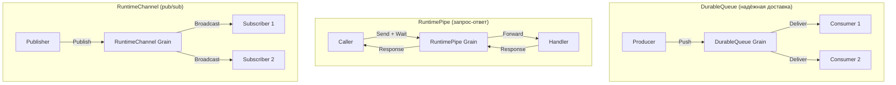
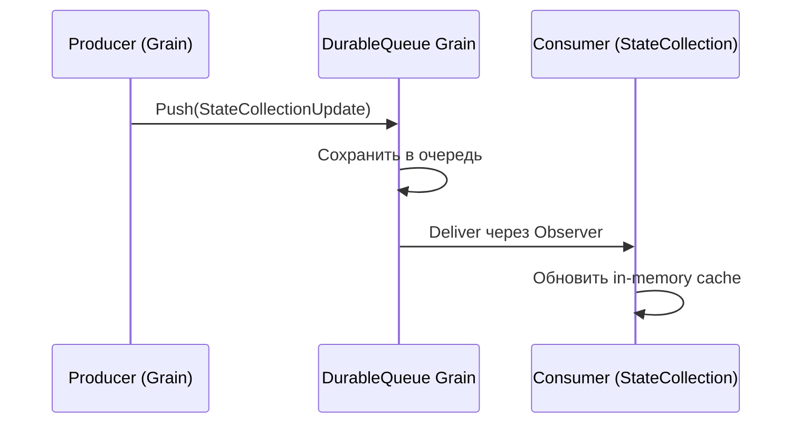
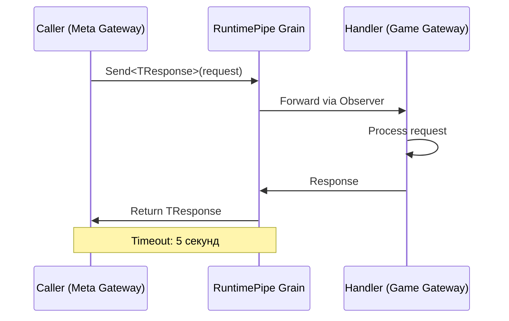
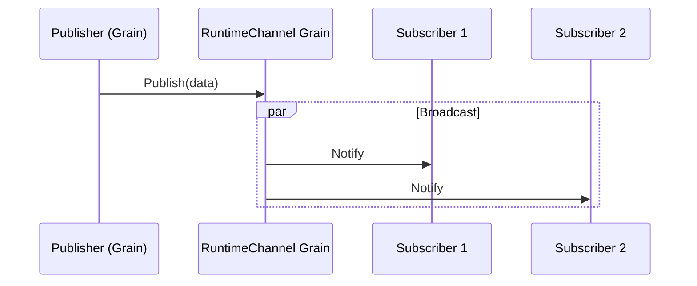

# Messaging

Три паттерна обмена сообщениями, агрегированные в `IMessaging`.

## Обзор паттернов



---

## DurableQueue

**Назначение:** Надёжная доставка сообщений для синхронизации `StateCollection`.

| Характеристика | Значение |
|---------------|----------|
| Тип грейна | `IGrainWithStringKey` |
| Гарантия доставки | At-least-once |
| Подписчики | Множественные (multi-observer) |
| Deactivation | Auto-timeout |

### Как работает



### Использование

Основное применение — `StateCollection` sync:
- ID очереди: `StateCollectionDurableQueueId<TKey, TValue>`
- Payload: `StateCollectionUpdate<TKey, TValue>`
- Грейн вызывает `OnUpdatedTransactional()` -> push в DurableQueue -> все StateCollection-инстансы получают обновление

---

## RuntimePipe

**Назначение:** Request-response коммуникация между сервисами с таймаутом.

| Характеристика | Значение |
|---------------|----------|
| Тип грейна | `IGrainWithStringKey` |
| Таймаут | 5с (50с с дебаггером) |
| Observer | `IRuntimePipeObserver` |
| Keep-alive | Конфигурируемый |

### Как работает



### Использование

Основное применение — создание игровых сессий:
1. `MatchFactory` (Meta) отправляет pipe-запрос
2. `SessionEndpoints` (Game) обрабатывает запрос, создаёт сессию
3. Ответ с `SessionId` возвращается через pipe

---

## RuntimeChannel

**Назначение:** Широковещательный pub/sub для реалтайм-уведомлений.

| Характеристика | Значение |
|---------------|----------|
| Тип грейна | `IGrainWithStringKey` |
| Concurrency | `[AlwaysInterleave]` |
| Подписчики | ConcurrentDictionary |
| Observer | `IRuntimeChannelObserver` |

### Как работает



### Использование

1. **Проекции пользователей:**
   - `UserProjection` публикует обновления через per-user channel
   - Клиент подписывается при подключении
   - ID канала: `UserProjectionChannelId`

2. **Распространение конфигов:**
   - Admin обновляет `CardConfigOptions`
   - Публикация через `AddressableStateChannelId`
   - Все сервисы получают обновлённый конфиг

---

## Сравнение паттернов

| Паттерн | Надёжность | Направление | Задержка | Применение |
|---------|-----------|-------------|----------|-----------|
| **DurableQueue** | Гарантированная | 1 -> N | Средняя | State sync |
| **RuntimePipe** | С таймаутом | 1 -> 1 | Низкая | Request-response |
| **RuntimeChannel** | Best-effort | 1 -> N | Низкая | Realtime уведомления |

## IMessaging

Фасад, агрегирующий все три паттерна:

```
IMessaging
  ├── DurableQueueClient  — Push / Listen
  ├── RuntimePipeClient   — Send / BindObserver
  └── RuntimeChannelClient — Publish / AddObserver
```

## Ключевые файлы

| Файл | Описание |
|------|----------|
| `backend/Infrastructure/Messaging/Messaging.cs` | Фасад IMessaging |
| `backend/Infrastructure/Messaging/Queues/DurableQueue.cs` | DurableQueue grain |
| `backend/Infrastructure/Messaging/Pipes/MessagePipe.cs` | RuntimePipe grain |
| `backend/Infrastructure/Messaging/Channels/RuntimeChannel.cs` | RuntimeChannel grain |
