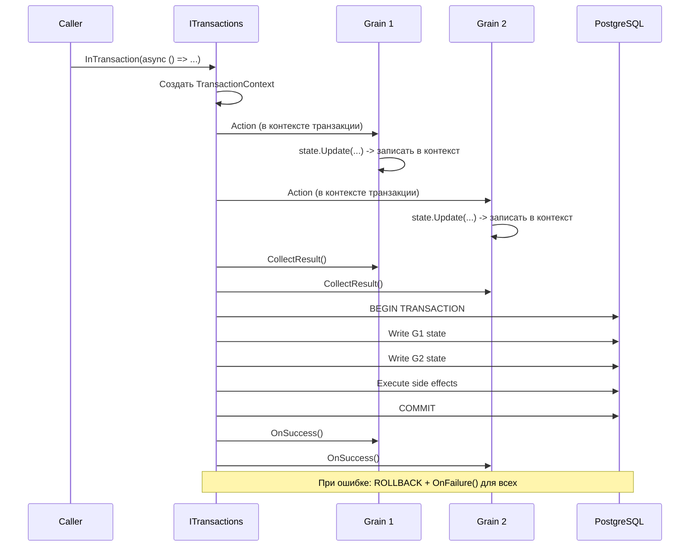
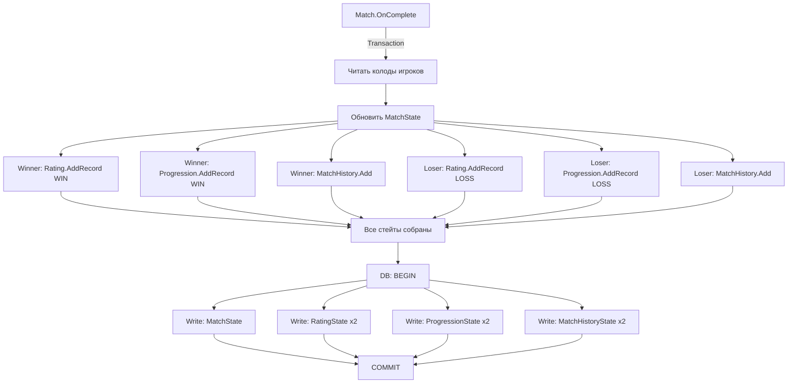

# Транзакции

Кастомная ACID-транзакционная система поверх Orleans.

## Обзор

Не используется встроенный Orleans Transactions. Вместо этого — собственная реализация через `ITransactions`, обеспечивающая:
- **Atomicity** — все изменения или ничего
- **Consistency** — состояние валидно после коммита
- **Isolation** — через TransactionContext (thread-local)
- **Durability** — PostgreSQL + JSONB

---

## Поток транзакции



---

## Компоненты

### ITransactions
Оркестратор транзакций.

| Фаза | Описание |
|------|----------|
| 1. Execution | Выполнение бизнес-логики с TransactionContextProvider |
| 2. Collect | Сбор изменений состояний от всех участников |
| 3. Commit | DB-транзакция: записи стейтов + side effects |
| 4. Callback | Уведомление участников (OnSuccess/OnFailure) |

### TransactionContext
Per-transaction state holder (thread-local через `TransactionContextProvider`):

```
TransactionContext:
  Participants: Dictionary<GrainId, IGrainTransactionHandler>
  SideEffects: List<ISideEffect>
```

### IGrainTransactionHandler
Extension для грейнов, участвующих в транзакциях:

| Метод | Описание |
|-------|----------|
| `OnSuccess()` | Вызывается после успешного коммита |
| `OnFailure()` | Вызывается при откате |
| `CollectResult()` | Собирает изменённые стейты |

---

## Пример: Match.OnComplete()



7 стейтов обновляются атомарно в одной DB-транзакции.

---

## Атрибут [Transaction]

> Это **кастомный** атрибут из `Infrastructure`, не Orleans-native.

Помечает методы грейна, вызываемые внутри транзакционного контекста. Все User-грейны помечены `[Transaction]`.

```csharp
[Transaction]
public async Task SetName(string name) {
    await _state.Update(s => { s.Name = name; });
}
```

---

## Side Effects

Побочные эффекты, выполняемые после коммита транзакции:

1. Регистрируются во время транзакции через `TransactionContext.SideEffects`
2. Записываются в БД вместе со стейтами
3. Обрабатываются `SideEffectsWorker` (IHostedService)
4. Конфигурируются через `SideEffectsOptions`

Примеры: push-уведомления через DurableQueue, обновление StateCollection.

---

## State Storage

### PostgreSQL
- JSONB-хранилище с версионированием
- ADO.NET (Npgsql)
- Таблица на каждый тип стейта (из `StatesLookup`)

### Миграции
`IStateMigrations` автоматически мигрирует старые версии стейтов при чтении:
- Каждый стейт имеет `Version` (int)
- При несовпадении версии — миграционная цепочка

### Кеширование
`StateStorageCache` кеширует повторные чтения в рамках запроса.

## Ключевые файлы

| Файл | Описание |
|------|----------|
| `backend/Infrastructure/Orleans/Transactions/Transactions.cs` | Оркестратор транзакций |
| `backend/Infrastructure/Orleans/Transactions/TransactionContext.cs` | Контекст транзакции |
| `backend/Infrastructure/Orleans/Transactions/GrainTransactionHandler.cs` | Grain extension |
| `backend/Infrastructure/Orleans/State/StateStorage.cs` | PostgreSQL persistence |
| `backend/Infrastructure/Orleans/State/StateMigrations.cs` | Миграции версий |
| `backend/Infrastructure/Orleans/State/StateSerializer.cs` | MemoryPack сериализация |
| `backend/Infrastructure/Orleans/Utils/OrleansUtils.cs` | IOrleans: InTransaction() |
