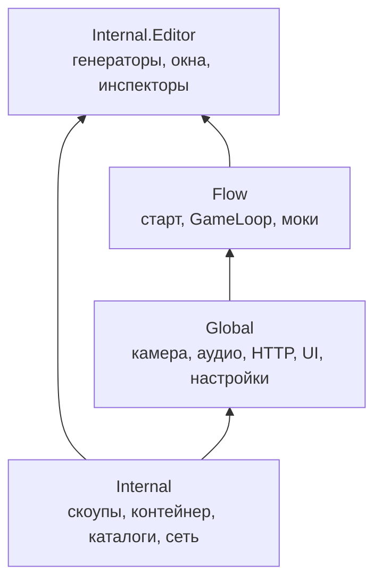
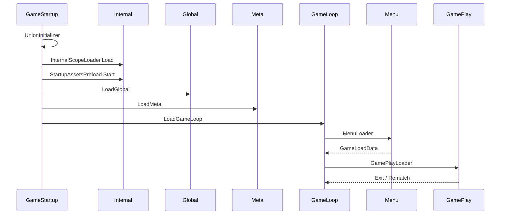
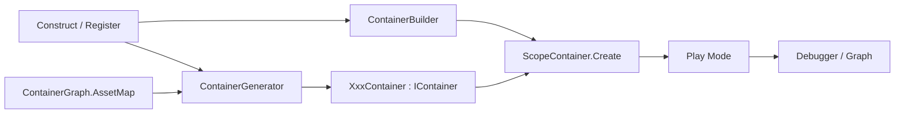

# Клиент: Common

`client/Assets/Common` — фундамент Unity-клиента. Здесь живут загрузка приложения, DI, скоупы, каталоги ресурсов, реактивность, глобальные сервисы и редакторные генераторы. Игровые режимы (`Menu`, `GamePlay`, `Meta`) стоят **над** Common и подключаются через Flow.

Подробный разбор редакторных тулов: [[client-dev-tools|Клиент: инструменты разработки]].

---

## Три сборки



| Сборка | Asmdef | Роль |
|--------|--------|------|
| **Internal** | `client/Assets/Common/Internal/Runtime/Internal.asmdef` | Скоупы, контейнер, lifetimes, каталоги, сеть, профайлер, updater |
| **Global** | `client/Assets/Common/Global/Global.asmdef` | Инфраструктура приложения: камера, аудио, HTTP, ввод, publisher, UI |
| **Flow** | `client/Assets/Common/Flow/Flow.asmdef` | Точка входа, GameLoop, моки. Ссылается на Meta / Menu / GamePlay |
| **Internal.Editor** | `client/Assets/Common/Internal/Editor/Internal.Editor.asmdef` | Только Editor: каталоги, биндинги, контейнер, Project Tools |

У runtime-сборок `autoReferenced: false` — зависимости явные. `Internal.Editor` — `autoReferenced: true`, платформа Editor.

VContainer в продакшн-скоупах **нет**. Он остался только в бенчмарках контейнера (`Internal.Tests`).

---

## Слои внутри Common

| Папка | Что внутри |
|-------|------------|
| `Flow/` | `GameStartup`, `GameLoop`, лоадеры меню/матча, моки |
| `Global/` | Скоуп Global: камера, аудио, HTTP, ввод, Itch, настройки, загрузочные экраны, UI-дизайн |
| `Internal/Runtime/` | Скоупы, контейнер, реактивность, каталоги, сеть, анимации, профайлер |
| `Internal/Editor/` | Генераторы каталогов, Hierarchy Bindings, Container Graph/Debugger, Project Tools |
| `Internal/Tests/Editor/` | Тесты lifetimes / EventSource / codegen контейнера, бенчмарк vs VContainer |
| `Resources/` | `AssetCatalog.asset`, JSON карточек/баффов/режимов |

---

## Старт приложения

Точка входа — сцена `Flow/Startup/Startup.unity`, компонент `GameStartup`.



| Этап | Файл | Что происходит |
|------|------|----------------|
| Unions | `Flow/Loop/UnionInitializer.cs` | Регистрация MemoryPack union-типов протокола |
| Internal | `Flow/Startup/InternalScopeLoader.cs` | `AssetCatalog.Load()`, корневой контейнер, лоадеры скоупов |
| Preload | `Internal/Runtime/Catalogues/Shared/StartupAssetsPreload.cs` | Параллельный Retain спрайтов меты (`CardsIcons`, `CardBuffs`, `MenuPlay`, `Portraits`) — на всё время приложения |
| Global | `Global/Setup/GlobalScopeExtensions.cs` | Сцена `Global_Services`: updater, аудио, камера, ввод, HTTP, settings, publisher, UI |
| Meta | `client/Assets/Meta/MetaScopeExtensions.cs` | Авторизация, WebSocket меты, матчмейкинг, реестры |
| GameLoop | `Flow/Loop/GameLoop.cs` | Цикл Menu ↔ GamePlay (Exit / Rematch) |

Трасса `GameProfiler.Begin("Startup")` открывается в `GameStartup` и закрывается в меню, когда экран загрузки снимается. Подробнее: [[client-dev-tools#Startup Profiler|Startup Profiler]].

Моки (`MenuMock`, `GameMock`) поднимают Internal → Global → Meta, но **не** создают GameLoop. Их включает `MockSwitcher` при Play Mode, если в сцене нет `GameStartup`.

---

## Скоупы

Два вида скоупов.

| | Service scope | Entity scope |
|--|---------------|--------------|
| Лоадер | `ServiceScopeLoader` | `EntityScopeLoader` |
| Билдер | `IScopeBuilder` | `IEntityBuilder` |
| Результат | `ILoadedScope` | `IEntityScopeResult` |
| Сцена | Опционально (runtime / Addressables / без сцены) | Привязан к `IScopeEntityView` |
| Примеры | Internal, Global, Meta, GameLoop, Menu, GamePlay | Карта, игрок, сущность на поле |

Цепочка родителей задаётся атрибутом `[ContainerScopeParent]` на методе `Construct` — по нему генератор контейнера строит граф.

```
Internal.Construct
  └─ Global.Construct
       └─ Meta.Construct
            ├─ GameLoop.Construct
            │    ├─ Menu
            │    └─ GamePlay
            └─ моки: MenuMock / GameMock (без GameLoop)
```

### Жизненный цикл service-скоупа

`ServiceScopeLoader.Load`:

1. Загрузить сцену-биндер (если есть).
2. `ConstructCallback` — регистрации в `ContainerBuilder`.
3. `BeforeBuild` — Retain каталожных групп.
4. `ScopeContainer.Create(rootId, builder)` — **только** сгенерированный класс.
5. `RunConstruct` — колбэки setup.
6. Позже `Initialize()` — `IScopeLoaded*`.
7. Dispose: dispose-колбэки → terminate lifetime → unload сцен → dispose контейнера.

Корень скоупа — **группа методов**, не лямбда. `GeneratedScopes.RootId(method)` выбирает сгенерированный класс.

### Сцена как набор сервисов

`ISceneService` — только регистрация:

```csharp
void Create(IScopeBuilder builder);
```

`SceneServicesFactory` на сцене держит сериализованный массив `MonoBehaviour[]`. В рантайме фабрика зовёт `Create` у каждого. Список обновляет редакторный `Assets/Scan services` (`Ctrl+E`), а не автопоиск при загрузке.

Setup — отдельные интерфейсы, резолвятся из контейнера после сборки (`EventLoop.RunConstruct`):

| Этап | Синхронный | Асинхронный |
|------|------------|-------------|
| До setup | `IScopeBaseSetup` | `IScopeBaseSetupAsync` |
| Setup | `IScopeSetup` | `IScopeSetupAsync` |
| После setup | `IScopeSetupCompletion` | `IScopeSetupCompletionAsync` |
| После `Initialize()` | `IScopeLoaded` | `IScopeLoadedAsync` |
| Dispose | `IScopeDispose` | `IScopeDisposeAsync` |

Синхронные слушатели идут по очереди (каждый — отдельный отрезок профайлера). Асинхронные стартуют пачкой через `WhenAll` и кладутся как `GameProfiler.Concurrent`.

---

## Контейнер (рантайм)

Свой DI, не VContainer. Installer'ы пишут регистрации в `ContainerBuilder`; сам `IContainer` — **Roslyn-сгенерированный sealed-класс** на корень (`Construct` / `Build` / `[ContainerGraphRoot]`). Фоллбэка на рефлексию для скоупа нет: нет класса — исключение.



Ключевые типы — `client/Assets/Common/Internal/Runtime/Tools/Container/`:

| Тип | Роль |
|-----|------|
| `IContainer` | Resolve / Inject, `Lifetime`, `Diagnostics` |
| `ContainerBuilder` | Сбор регистраций и «дырок» (`WithParameter`, готовые инстансы) |
| `GeneratedScopes` | Реестр фабрик по `rootId` |
| `ScopeContainer` | `GeneratedScopes.Create` — единственный путь создать скоуп |
| `ServiceLifetime` | Transient / Scoped / Singleton |
| `BuilderExtensions` | `Register`, `As`, `WithParameter`, `Inject` — **имена завязаны на генератор** |

Цепочка `Register().As<T>()` пишется расширениями `BuilderExtensions`. Методы `IServiceRegistration` названы иначе специально: генератор должен видеть только вызовы расширений.

Генерация, манифесты, дебаггер и живой граф — в [[client-dev-tools#Контейнер|инструментах разработки]].

---

## Каталоги ресурсов (рантайм)

Общая база — `AssetGroup`: retain-счётчик, одна inflight-загрузка, Addressables или Resources.

| Каталог | Доступ | Загрузка |
|---------|--------|----------|
| Спрайты | `Sprites.Cards.Icon` | `LoadSpriteGroup` / `RequestSpriteGroup` |
| Префабы | `GlobalPrefabs.GlobalCamera`, `MenuPrefabs.*` | Retain группы; Global — Resources, без Retain |
| Env-ассеты | `InternalAssets.OptionsContainer`, `GamePlayAssets.*` | `AssetCatalog.Load()` один раз на старте |
| Сцены | `Scenes.Menu`, `Scenes.GameField` | GUID → Addressables, кроме сцен из Build Settings |
| Цвета | `Colors.Deck.Attack` | Статические поля, без загрузки |

Правило: Addressable-группа не грузится из геймплея через `Addressables.LoadAssetAsync`. Только `Request*` (BeforeBuild) или `Load*` (сразу, если группа нужна уже в Construct). `EnsureLoaded()` у Addressable **бросает**, если Retain не было.

Генерация групп и Addressables — в [[client-dev-tools#Каталоги|каталогах]].

---

## Реактивность и Lifetime

`client/Assets/Common/Internal/Runtime/Common/Reactive/`

**Lifetime** — область подписок. Terminate родителя гасит детей. Каждая подписка обязана получить `IReadOnlyLifetime`.

| Тип | Семантика |
|-----|-----------|
| `EventSource` | Событие. `Advise` — только будущие |
| `ViewableProperty` / `LifetimedValue` | Состояние. `View` = текущее + будущие, `Advise` = только будущие |
| `ViewableList` | Элемент получает свой lifetime; Remove его terminate'ит |

Lifetime скоупа — `parent.Lifetime.Child()`. UI обычно `View`, события — `Advise`.

---

## Global

Конструкт: `GlobalScopeExtensions.Construct`, runtime-сцена `Global_Services`.

| Подсистема | Папка | Что регистрирует |
|------------|-------|------------------|
| Updater | `Internal/.../Services/Updaters` + `Global/Setup/GlobalUpdaterExtensions.cs` | `GlobalPrefabs.GlobalUpdater`, `DelayRunner` |
| Audio | `Global/Audio/` | Плеер и слушатель |
| Camera | `Global/Cameras/` | Глобальная камера, `CurrentCamera` |
| Input | `Global/Inputs/` | Ограничения ввода, EventSystem из `Global_Events` |
| HTTP | `Global/Backend/` | `BackendClient` (REST к Meta Gateway) |
| Settings | `Global/Settings/` | Громкость и прочие сохранения |
| Publisher | `Global/Publisher/` | Itch saves / языки по `PlatformType` |
| UI | `Global/UI/` | Loading screen (WebGL — `WebLoadingScreen.jslib`), `UIStateMachine`, кнопки/элементы |

Опции живут в `Internal/Runtime/Options/OptionsContainer.asset`: debug, backend URL, platform, version. В Internal-скоупе регистрируются как отдельные инстансы.

---

## Сетевой тулкит

Лежит в Common, используется снаружи:

`client/Assets/Common/Internal/Runtime/Tools/Network/`

| Слой | Типы | Кто ставит |
|------|------|------------|
| Транспорт | `NetworkConnection`, `DefaultWebSocket` / `JsWebSocket` | Meta: `AddNetworkConnection()` |
| Сессия матча | `NetworkSession`, сущности, пользователи, команды | GamePlay: `AddSessionServices()` |
| HTTP | `BackendClient` | Global |

Подробнее протокол: [[client-network|Клиент: сеть]].

---

## Updater

Один `Updater` MonoBehaviour на Global. Дочерние скоупы получают `UpdaterProxy` и вешают `IUpdatable` / `IFixedUpdatable` на lifetime.

Дополнительно: `DelayRunner`, `UpdateDelay`, `ProgressionLoop`, `UpdatableAction` — таймеры и прогрессии без корутин.

---

## Тесты

`client/Assets/Common/Internal/Tests/Editor/`

| Область | Файлы |
|---------|-------|
| Lifetime / EventSource / ModifiableList | корневые тесты |
| Codegen контейнера | `Container/ScopeCodegenEmitTests.cs`, `ScopeCodegenDiagnosticTests.cs` |
| Поток | `ContainerThreadTests.cs` |
| Бенчмарк vs VContainer | `Container/Benchmarks/` |

VContainer в тестах — **только** baseline бенчмарка, не хост скоупов.

---

## Ключевые файлы

| Файл | Роль |
|------|------|
| `Flow/Startup/GameStartup.cs` | Точка входа |
| `Flow/Startup/InternalScopeLoader.cs` | Корневой скоуп |
| `Flow/Loop/GameLoop.cs` | Menu ↔ GamePlay |
| `Global/Setup/GlobalScopeExtensions.cs` | Global Construct |
| `Internal/Runtime/Scopes/Services/ServiceScopeLoader.cs` | Загрузка service-скоупа |
| `Internal/Runtime/Scopes/Services/ScopeContainer.cs` | Создание сгенерированного контейнера |
| `Internal/Runtime/Scopes/Common/Events/EventLoop.cs` | Фазы Construct / Loaded / Dispose |
| `Internal/Runtime/Catalogues/Shared/AssetGroup.cs` | Retain/Release групп |
| `Internal/Runtime/Tools/Container/Runtime/GeneratedScopes.cs` | Реестр сгенерированных скоупов |
