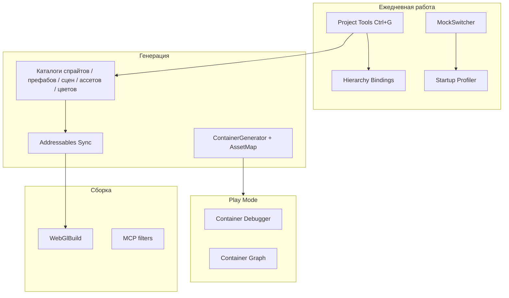
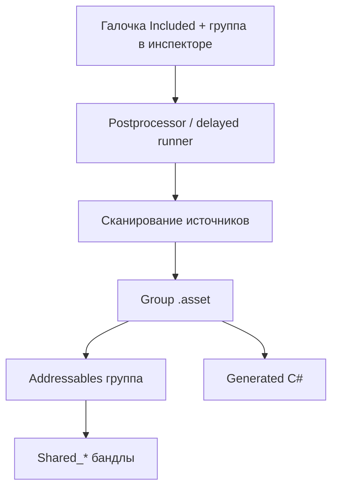
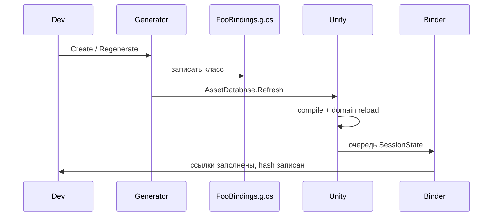

# Клиент: инструменты разработки

Редакторный слой Common. Задача — не писать GUID'ы, `[SerializeField]` на детей иерархии и addressable-группы руками, а генерировать их из ассетов и инспектора. Почти все тулзы живут в `client/Assets/Common/Internal/Editor/` и пишут в runtime-каталоги / Generated-папки модулей.

Архитектура Common, в которую они встроены: [[client-common|Клиент: Common]].

---

## Карта



| Нужно | Инструмент | Вход |
|-------|------------|------|
| Открыть сцену, сменить backend, перегенерировать каталоги, сбросить user id | Project Tools | `Tools/Project Tools` (`Ctrl+G`) |
| Свойства иерархии без ручных SerializeField | Hierarchy Bindings | `GameObject/Create Object Bindings` |
| Добавить арт / префаб / сцену в typed API | Каталоги + инспектор header | галочка Included + группа |
| Понять, почему скоуп не собрался | Container Debugger / Graph | Play Mode |
| Замерить старт | Startup Profiler | `Tools/Startup Profiler` |
| Итерация меню/матча без полного старта | Mock-сцена | Play без `GameStartup` |
| WebGL для деплоя | `WebGlBuild` | меню или batchmode |

---

## Принципы

1. **Источник правды — ассет, не C#.** Группа спрайта/префаба пишется в `importer.userData`. C# — следствие генерации.
2. **Генерация пачками и с дебаунсом.** `CatalogGenerationRunner`: не реентерабелен, ждёт импорт/компиляцию, 0.5 с debounce, в Play Mode не бежит.
3. **Писать файл только если изменился.** `GeneratedFile.WriteIfChanged` — меньше лишних рекомпиляций.
4. **Код в сборке потребителя.** `Global` / `Menu` / `GamePlay` получают `Assets/Generated/`. Остальные asmdef — `Generated` рядом с собой.
5. **Addressables — одна запись на группу.** Бандл = группа каталога. Общие зависимости выносятся в `Shared_*`.
6. **Редактор не ходит в runtime-сборку наоборот.** `ObjectBindings.RegenerateHandler` подставляется из Editor при загрузке домена.

---

## Project Tools

Окно-хаб. `client/Assets/Common/Internal/Editor/Tools/ProjectTools/`

`Tools/Project Tools` (`%g` → Ctrl/Cmd+G) — тоггл: повторное нажатие закрывает окно.

Хост грузит первый найденный `OptionsContainer`. Кнопка **Save** делает `SetDirty` + `SaveAssets`.

### Scenes

Все `t:Scene` под `Assets`. Сверху избранные: **Startup**, **Menu**, **Game_Field**.

- Клик — открыть (с сохранением).
- Ctrl/Cmd+клик — additive. Повтор по уже загруженной — закрыть (нельзя закрыть единственную активную).

### Current Scene

Счётчик `ObjectBindings` в активной сцене и **Regenerate All Bindings**.

Перегенерация запускает компиляцию. Несохранённая сцена сначала предлагается сохранить: биндинг после reload домена читает то, что на диске.

### Options

Правка `OptionsContainer.asset` через Undo + сразу `SetDirty` (иначе domain reload откатит до Save):

| Блок | Поля |
|------|------|
| Debug | gizmos, logs |
| Version | строка версии |
| Backend | Local / Production, URL'ы |
| Platform | `PlatformType` |

В **плеере** `BackendOptions.Url` всегда production. В Editor — по enum.

### Assets

Кнопки генераторов + **Run All** (prefabs → scenes → sprites; иконки карт в Run All не входят).

### User

PlayerPrefs `userId` (общий) и `userId:{hash dataPath}` (на этот клон проекта). Copy / Refresh / Clear с подтверждением. Нужен, чтобы пересоздать локального пользователя без правки реестра.

---

## Каталоги

Редактор: `Internal/Editor/Catalogues/`  
Рантайм: `Internal/Runtime/Catalogues/`

Общая инфраструктура:

| Тип | Роль |
|-----|------|
| `CatalogGenerationRunner` | Дебаунс, защита от реентерабельности |
| `AssetUserData` | JSON в `importer.userData` под своим ключом, чужие ключи не затирает |
| `CatalogInspectorGUI` / `CatalogGroupField` | Секция в header инспектора |
| `CatalogAddressablesSync` | Группа `{prefix}{name}`, одна запись — `.asset` группы, адрес = GUID |
| `SharedAddressablesSync` | Дедуп ассетов, на которые ссылаются ≥2 группы |
| `CatalogAssemblies` / `ModuleAssetLayout` | Куда писать `*Prefabs.cs` / `*Assets.cs` |
| `GeneratedFile` | Write-if-changed + уборка устаревших файлов по суффиксу |

Метаданные **не** в ScriptableObject на каждый png/prefab, а в userData импортера. Инспектор рисуется через `Editor.finishedDefaultHeaderGUI`.



### Спрайты

| | |
|--|--|
| Источник | `Assets/Art/**` (`.png` / `.psd` / `.aseprite`) |
| Ключ userData | `spriteCatalog`: included, group, kind Sheet/Animation, time, color |
| Группа по умолчанию | относительный путь под `Art/` → PascalCase |
| Меню | `Tools/GenerateSprites` |
| Авто | postprocessor + reload редактора |
| Выход | `Runtime/Catalogues/Sprites/Groups/{Group}.asset`, Addressables `Sprites_{Group}`, `Sprites.cs` + `{Group}Sprites.cs` |
| Рантайм | `Sprites.Cards.Name` после `LoadSpriteGroup` / `RequestSpriteGroup` |

Геттер бросает, если группа не загружена. Предзагрузка меты (`StartupAssetsPreload`) держит часть групп до конца сессии.

### Префабы

| | |
|--|--|
| Источник | любой `.prefab` с `prefabCatalog.included` |
| JSON групп | `Editor/Catalogues/Prefabs/PrefabGroups.json` (в т.ч. `nonAddressable`: сейчас `Global`) |
| Меню | `Tools/GeneratePrefabsCatalog` |
| Выход | Addressable: `.../Prefabs/Groups/{Group}.asset`; Resources: `.../Groups/Resources/PrefabGroups/{Group}.asset` |
| C# | `GlobalPrefabs`, `MenuPrefabs`, `GamePlayPrefabs` в `Assets/Generated` модуля |

Галочка **Addressable Group** общая на группу: снятие уносит **весь** `.asset` группы в Resources. Global-префабы так и едут в плеер без бандла — `GlobalScopeExtensions` их не Retain'ит.

`[PrefabDefinition]` / PrefabBuilder в клиенте **больше нет**. Каталог их заменил.

### Аудио

| | |
|--|--|
| Источник | любой аудиофайл (`.wav` / `.mp3` / `.ogg` / …) с `audioCatalog.included` |
| Ключ userData | `audioCatalog`: included, group, volume (слайдер 0..1 в инспекторе) |
| JSON групп | `Editor/Catalogues/Audio/AudioGroups.json` |
| Меню | `Tools/GenerateAudioCatalog` |
| Авто | postprocessor + reload редактора |
| Выход | `Runtime/Catalogues/Audio/Groups/{Group}.asset`, Addressables `Audio_{Group}` |
| C# | `MenuAudio`, `GamePlayAudio`, … в `Runtime/Catalogues/Audio/Generated` |
| Рантайм | `MenuAudio.Click` — `Sound { Clip, Volume }` — после `LoadAudioGroup(MenuAudio.Group)` / `RequestAudioGroup` |

Только Addressables: группы в Resources у аудио нет.

### Env-ассеты (options)

Маркерный баз-класс `EnvAsset`. Каталог — один `Assets/Common/Resources/AssetCatalog.asset`. Addressables нет: группы — только namespace.

`InternalScopeLoader` зовёт `AssetCatalog.Load()` до сборки корневого контейнера. Дальше `InternalAssets.OptionsContainer`, `GlobalAssets.SettingsOptions`, `GamePlayAssets.CardDragOptions`.

Создать options из скрипта: `Assets/Create from sources` (`Ctrl+Q`) — кладёт `.asset` в `{Module}/Assets/Options/`.

Отдельного postprocessor'а нет: генерация с reload / меню / инспектора.

### Сцены

Сканирует `Assets/Common`, `GamePlay`, `Menu`, `Meta`. Пишет `Scenes.cs` (`StaticScene` с GUID).

Сцены из **Build Settings** в Addressables не попадают — иначе они оказались бы в билде дважды. Остальные — группы `Scenes_{домен}` (второй сегмент пути: Menu, GamePlay, …), адрес = путь ассета.

Меню `Tools/GenerateScenes`. Авто: reload + `EditorBuildSettings.sceneListChanged`. Runner'а нет, генерация прямая.

### Цвета

Один `Assets/Art/ColorCatalog.asset`. Генератор пишет `Colors.cs` со статическими `readonly Color`. Нет Addressables, нет автозапуска — только `Tools/GenerateColors` и кнопка на ассете.

### Shared Addressables

Ассет без своей записи, на который ссылаются несколько групп, Unity копирует в каждый бандл. `SharedAddressablesSync` делает его явной записью `Shared_Common` / `Shared_Menu` / `Shared_GamePlay`.

Фаза берётся из таблицы потребителей (`Sprites_Cards` → GamePlay, `Prefabs_Menu` → Menu, шрифты/плагины → Common). Ошибка в таблице не ломает загрузку — фаза просто поднимет лишний бандл.

Перед WebGL-сборкой sync зовётся **синхронно**: в batchmode отложенный пересчёт не успевает.

---

## Hierarchy Bindings

Замена ручных `[SerializeField] Transform _foo` на сгенерированное зеркало иерархии.

Рантайм: `Internal/Runtime/Tools/HierarchyBindings/`  
Editor: `Internal/Editor/Tools/HierarchyBindings/`

### Зачем

Пользовательский класс **наследует** сгенерированный `FooBindings : ObjectBindings`. Свойства — компоненты и дети. Отдельной «вьюхи-обёртки» нет.

Две фазы, потому что между записью `.g.cs` и появлением типа перезагружается домен. Заявка на биндинг живёт в `SessionState`.



### Как пользоваться

1. Выделить объект → `GameObject/Create Object Bindings` (или `Tools/Object Bindings/Create For Selection`).
2. Имя / namespace (при повторной генерации заблокированы — не плодить второй тип).
3. Опционально **Is Scene Service** / **Is Entity Component** — генератор допишет `ISceneService.Create` / `IEntityComponent.Register`.
4. После компиляции на объекте висит сгенерированный компонент; пользовательский класс наследует его и может добавить логику.
5. Кнопка Odin **Regenerate** на `ObjectBindings` или Current Scene → **Regenerate All Bindings**.

### Правила сканера

- Полное зеркало, включая вложенные префабы.
- Граница: другой `IObjectBindings` (ссылка на него, внутрь не лезем — у Unity 7 уровней вложенной сериализации не-Object типов).
- `HierarchyBindingsIgnoreChildren` обрубает ветку.
- Пропускаются `CanvasRenderer` и сам ignore-маркер.
- Имена — валидные C# идентификаторы; столкновение с членами `MonoBehaviour` отклоняется.
- Файл пишется в Generated **сборки владельца** (первый проектный скрипт на объекте, не сами биндинги). Фоллбэк: `Assets/Common/Internal/Runtime/Tools/PrefabHierarchy/Generated`.

Сгенерированный класс содержит:

- `[SerializeField, HideInInspector]` поля и публичные геттеры;
- вложенные `[Serializable]` классы детей;
- комментарий-карту иерархии и `// Structure: {md5}`;
- виртуальный `Create`/`Register`, если стоят галочки DI.

Хеш структуры нужен, чтобы понять, что иерархия уехала от кода. Биндер заполняет ссылки по тому же дереву, из которого писал поля — искать по имени в рантайме не надо.

Пакетная перегенерация складывает все `.g.cs`, и только потом один Refresh: иначе домен поедет посреди обхода.

---

## Контейнер

Три редакторных куска плюс Roslyn-генератор вне Unity.

### ContainerGenerator (Roslyn)

Исходники: `client/Tools~/ContainerGenerator/` (папка `Tools~` Unity игнорирует).  
DLL: `client/Assets/Plugins/ContainerGenerator/` с лейблом **RoslynAnalyzer**, все платформы выключены.

Сборка:

```bash
dotnet build client/Tools~/ContainerGenerator/ContainerGenerator.csproj -c Release
```

Post-build копирует только `ContainerGenerator.dll`. `Microsoft.CodeAnalysis*.dll` класть рядом нельзя. Пин — `Microsoft.CodeAnalysis.CSharp` **4.3.0** (ветка 4.x, которую ест Unity).

Генератор на каждую игровую сборку:

1. Обходит методы `Construct` / `Build` / `[ContainerGraphRoot]` и вложенные installer'ы.
2. Подмешивает манифесты других сборок (`[assembly: ContainerInstaller]`).
3. Читает `[assembly: ContainerGraphAsset]` — какие компоненты на префабах/сценах зовут `Create`/`Register`.
4. Резолвит рёбра, циклы, порядок конструкции.
5. Эмитит sealed `{Type}{Method}Container : IContainer` и регистрацию в `GeneratedScopes` через `[RuntimeInitializeOnLoadMethod]`.

Родитель скоупа — `[ContainerScopeParent(typeof(X), nameof(X.Construct))]`. Не резолвится → диагностика `CINGR007`. Для сущностей есть варианты по типу вьюхи (`rootId@ViewType`).

Имена `BuilderExtensions.Register/As/WithParameter/...` для генератора **зафиксированы**. Переименовать без правки `GraphWalker` нельзя.

README генератора ещё описывает старый шаг `{Type}GeneratedInjector`. Актуальный пайплайн эмитит **класс скоупа целиком**. Папка `Injector/` осталась как анализ ctor/`[Inject]` для `EdgeResolver`.

### Asset map (сцены и префабы)

`Internal/Editor/Tools/ContainerCodegen/`

`ContainerGraphPostprocessor` на импорт/удаление/перенос `.prefab`/`.unity`, на reload и по меню `Tools/GenerateContainerGraphAssets`:

1. `ContainerGraphAssetScanner` читает YAML (не грузит объекты в редактор). Ищет `SceneServicesFactory` и entity-holder'ы.
2. `ContainerGraphAssetWriter` пишет `ContainerGraph.AssetMap.cs`.

Имя файла **не** должно кончаться на `Assets.cs`: такой суффикс считает своим генератор Env-каталога и сотрёт как устаревший.

Без этой карты генератор не увидит `ISceneService.Create` на объектах сцены — только вызовы из C#.

### Container Debugger

`Tools/Container Debugger`. Read-only. Данные только из `ContainerRegistryDebug` / `IContainerDiagnostics`.

- Дерево корней и детей.
- Таблица регистраций: слот, тип, сервисы, lifetime, создан ли экземпляр.
- Порядок конструкции выбранного слота, внешние зависимости, загруженные asset-группы.
- Подписка на `Changed` + обновление при входе/выходе из Play Mode.

История Resolve в UI есть, в рантайме `ContainerDiagnostics.History` сейчас всегда пустой список — заглушка.

Бенчмарки ставят `ContainerRegistryDebug.IsEnabled = false`, чтобы диагностика не входила в замер. В релизе без `UNITY_EDITOR`/`DEBUG` диагностика в сгенерированных ctor не создаётся.

### Container Graph

`Tools/Container Graph`. Живой граф Graph Toolkit по тем же `ContainerRegistryDebug.Roots`.

Ассет `ContainerGraph/Transient/ContainerLiveGraph.containergraph` — **черновик**, не источник правды. Дерево растёт слева направо по глубине скоупа. Статус: «нет контейнеров» в Edit Mode / ожидание первого `Build` в Play Mode.

---

## Startup Profiler

Замер загрузки, не Unity Profiler как таковой (хотя кадры из него можно приложить).

Рантайм: `Internal/Runtime/Tools/Profiling/`  
Editor: `Internal/Editor/Tools/Profiling/`  
Окно: `Tools/Startup Profiler`

`GameProfiler` — статика: этапы размазаны по extension-методам скоупов, куда DI не протащить.

| API | Когда |
|-----|--------|
| `Begin` / `Finish` | Старт трассы. Startup закрывается в меню; GamePlay — когда матч поехал |
| `Scope` | Вложенный отрезок, встаёт на стек |
| `Concurrent` | Параллельный сосед (WhenAll групп ассетов). На стек не встаёт — иначе следующий WhenAll вложился бы в него |
| `Branch` | Fire-and-forget ветка в корне трассы (загрузка меню из GameLoop) |
| `Detached` | Параллель ко всему старту (`StartupAssetsPreload`) |
| `Ambient` | После await вернуть текущий отрезок |

Файлы: `client/traces/trace_{timestamp}.json` (в плеере — `persistentDataPath/ProfilerTraces/`). Хранятся последние 20. WebGL качает через `ProfilerTraceDownload.jslib`.

Первый запуск после рекомпиляции помечается `ColdDomain` — с тёплым не сравнивать.

Окно — водопад: дерево слева, шкала времени справа. Если выйти из Play Mode, не дойдя до меню, окно само зовёт `Finish()`, чтобы недогруженный старт тоже был виден.

Опционально **Frames** (EditorPrefs `Internal.Profiler.CaptureFrames`): Unity Profiler поднимается ещё в Edit Mode, иначе самые тяжёлые первые кадры Play не попадут в буфер. Лимиты: 900 кадров, 1500 сэмплов/кадр, 150k всего, минимум 0.1 ms.

---

## Моки

`Flow/Mocks/` + `Internal/Editor/Tools/MockSwitcher.cs`.

`MockSwitcher` на `EnteredPlayMode`: если в сцене уже есть `GameStartup` — ничего не делать (мок из меню, загруженного обычным стартом, иначе поднял бы второй бутстрап). Иначе найти `MockBase` и `Process()`.

| Мок | Что делает |
|-----|------------|
| `MenuMock` | Internal → Global → Meta → `LoadMenuMock` → `IMenuLoop` |
| `GameMock` | То же + ждёт `IMetaState.IsReady`, `CreateGameWithBot`, `LoadPvPMock` |

У `GameMock` есть one-shot фикстура в EditorPrefs `MinesLeader.GameMock.Fixture`: JSON руки/поля, который кладёт агент (`tools/scripts/game-agent.py`). Ключ читается один раз и удаляется — сцена не меняется.

`ScopeLoadOptions.AsMock()` ставит `builder.IsMock` — construct может не грузить лишние сцены.

---

## Сборка и гигиена

### WebGlBuild

`Tools/Build/WebGL`. CI:

```text
Unity -quit -batchmode -projectPath client -executeMethod Internal.WebGlBuild.Build
```

Опционально `-buildOutput` (по умолчанию `client/build` — это же пакует Docker). Перед билдом `SharedAddressablesSync.Sync()`. В batchmode явный `EditorApplication.Exit(0|1)`: один `-quit` глотает исключения и выходит 0, деплой тогда упаковал бы старый билд.

Связанный документ: [[client-webgl-build-size|размер WebGL-билда]].

### MCP for Unity

Пакет нужен редактору, в плеер тащить нельзя.

- `McpPlayerAssemblyFilter` (`IFilterBuildAssemblies`) выкидывает `MCPForUnity.Runtime` — иначе линкер оставляет MonoBehaviour, а с ним Newtonsoft.
- `McpScreenshotsFolder` на загрузке проекта пишет EditorPrefs скриншотов в `Temp/Screenshots`, не в `Assets/Screenshots`.

### LinkerGenerator — выключен

Весь `IPreprocessBuildWithReport` и меню `Tools/Generate link.xml` закомментированы: `preserve="all"` на своих сборках не давал линкеру вырезать мёртвый код. Файл оставлен как история решения.

### CardIconsExporter

Читает `Assets/Common/Resources/cards-info.json`, экспортирует PNG в `docs/obsidian/game/cards/icons/{type}.png`. Своего MenuItem нет — кнопка в Project Tools → Assets.

### ScriptableObject

| Меню | Что |
|------|-----|
| `Assets/Create Scriptable Object` | Odin-окно всех SO проекта, превью, создание. В модуле — в `Assets/Options/` |
| `Assets/Destroy Nested Objects` | Снести вложенные sub-assets у выделенного |
| `Assets/Create from sources` (`Ctrl+Q`) | SO из выделенного `MonoScript` |
| `Assets/Scan services` (`Ctrl+E`) | Обновить массивы `SceneServicesFactory` во всех загруженных сценах |

---

## Меню и шорткаты

| Пункт | Шорткат |
|-------|---------|
| `Tools/Project Tools` | Ctrl/Cmd+G |
| `Tools/Container Debugger` | — |
| `Tools/Container Graph` | — |
| `Tools/GenerateContainerGraphAssets` | — |
| `Tools/Startup Profiler` | — |
| `Tools/GenerateSprites` | — |
| `Tools/GeneratePrefabsCatalog` | — |
| `Tools/GenerateAudioCatalog` | — |
| `Tools/GenerateScenes` | — |
| `Tools/GenerateAssetsCatalog` | — |
| `Tools/GenerateColors` | — |
| `Tools/SyncSharedAddressables` | — |
| `Tools/Build/WebGL` | — |
| `Tools/Container/Run Benchmark` | — |
| `Tools/Object Bindings/Create For Selection` | — |
| `GameObject/Create Object Bindings` | — |
| `Assets/Scan services` | Ctrl/Cmd+E |
| `Assets/Create from sources` | Ctrl/Cmd+Q |
| `Tools/Generate link.xml` | выключен |

---

## Ежедневный цикл

1. Открыть нужную сцену из Project Tools, не из Project window.
2. Новый UI-объект → Object Bindings → пользовательский класс наследует generated → при необходимости Scene Service.
3. Новый png/префаб → header инспектора: Included + группа. Генератор догонит сам (debounce). Если нет — Assets-вкладка.
4. Итерация фичи — mock-сцена (меню или vs-bot), без прохождения логина.
5. Старт тормозит — Startup Profiler, сравнить тёплый прогон с cold после рекомпиляции.
6. «Почему не резолвится» — Play + Container Debugger / Graph. Если класса скоупа нет — смотреть `CINGR*` и AssetMap (сцена/префаб попали в сканер?).
7. Смена Local/Production API — Options, Save.
8. Деплой — `WebGlBuild` (он сам синкает Shared Addressables).

---

## Ключевые пути

| Путь | Содержание |
|------|------------|
| `client/Assets/Common/Internal/Editor/Tools/` | Окна, биндинги, профайлер, моки, WebGL, MCP |
| `client/Assets/Common/Internal/Editor/Catalogues/` | Генераторы каталогов и Addressables |
| `client/Assets/Common/Internal/Runtime/Catalogues/` | Рантайм групп и generated C# |
| `client/Assets/Common/Internal/Runtime/Tools/Container/` | Контракты контейнера |
| `client/Tools~/ContainerGenerator/` | Roslyn-генератор скоупов |
| `client/Assets/Plugins/ContainerGenerator/` | Собранный analyzer |
| `client/traces/` | JSON трасс старта |
