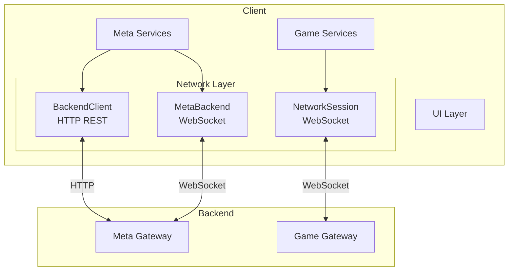
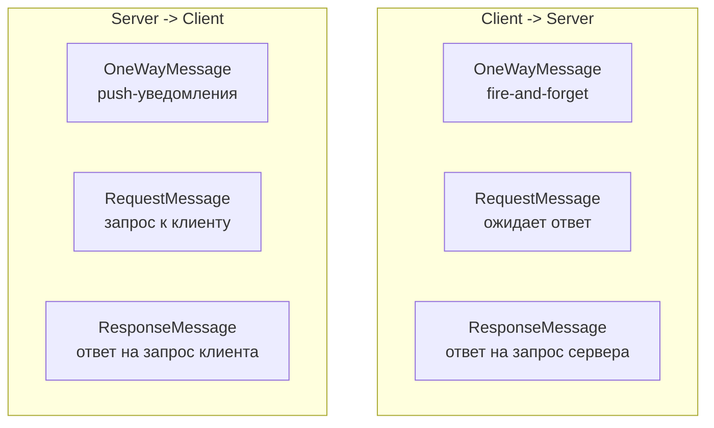
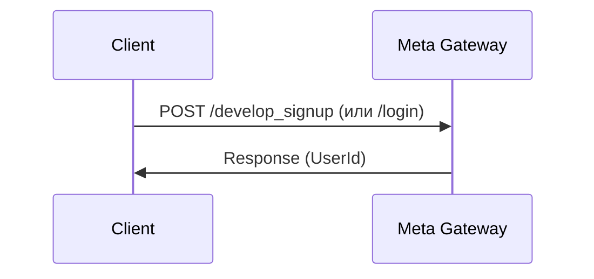
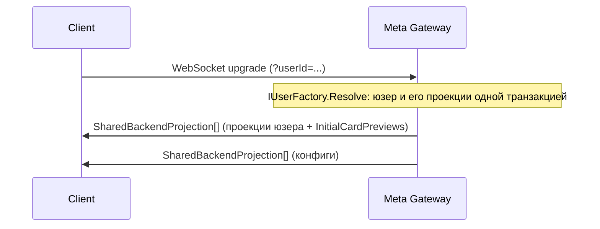
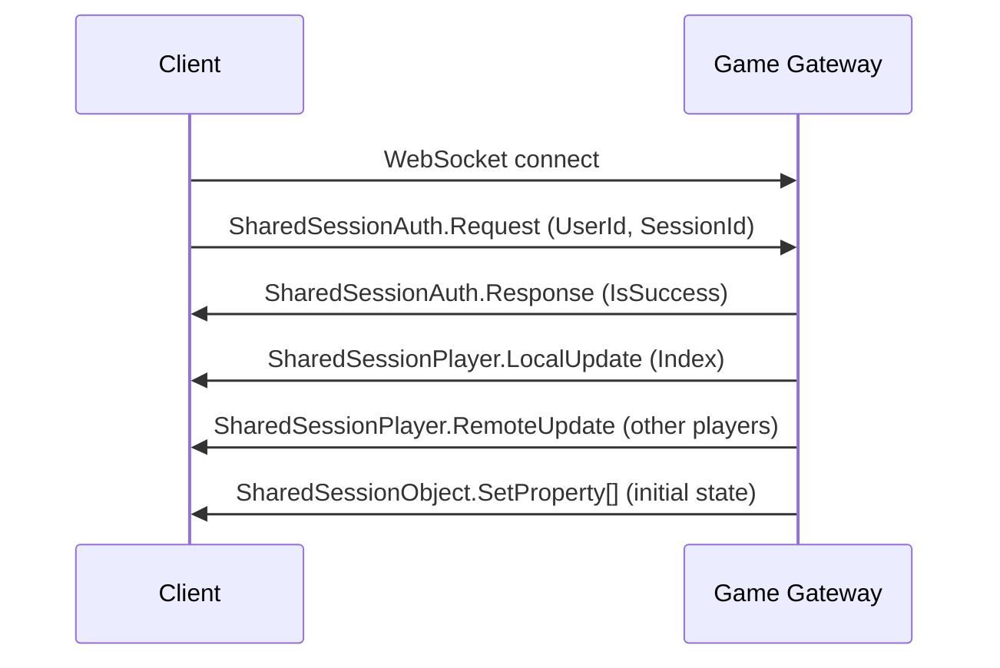

# Клиент: сетевой слой

## Обзор

---

## Два канала связи

### 1. Meta Backend (постоянное WebSocket-соединение)
**Файл:** `client/Assets/Meta/Connection/MetaBackend.cs`

Постоянное соединение с Meta Gateway для:
- Авторизация (`SharedBackendSocketAuth`)
- Матчмейкинг (`SharedMatchmaking`)
- Проекции пользователя (профиль, рейтинг, прогрессия)

### 2. Game Session (WebSocket на время матча)
**Файл:** `client/Assets/Common/Network/Session/Root/NetworkSession.cs`

Временное соединение с Game Gateway на время матча:
- Аутентификация сессии (`SharedSessionAuth`)
- Игровые команды (`SharedGameAction`)
- Синхронизация состояний (`SharedSessionObject`)

---

## WebSocket-реализации

**Файл:** `client/Assets/Common/Network/Connections/NetworkConnection.cs`

| Платформа | Реализация |
|-----------|-----------|
| Editor, iOS, Android | `DefaultWebSocket` (.NET WebSocket) |
| Web, ItchIO | `JsWebSocket` (JavaScript interop) |

`NetworkConnection` абстрагирует:
- Reader — чтение входящих сообщений
- Writer — отправка исходящих
- Dispatcher — маршрутизация по типу сообщения

---

## Протокол сообщений

Все сообщения сериализуются через **MemoryPack** (бинарный формат).

### Типы сообщений

Каждый request имеет `RequestId` для корреляции запрос-ответ.

---

## Авторизация

### HTTP-авторизация

### WebSocket-авторизация (Meta)

### WebSocket-авторизация (Game Session)

---

## Проекции (BackendProjection)

**Файл:** `client/Assets/Meta/Connection/BackendProjectionHub.cs`

Сервер отправляет проекции пользователя через Meta WebSocket:

| Проекция | Данные |
|----------|--------|
| `ProfileProjection` | Id, Name |
| `ProgressionProjection` | Experience |
| `DeckProjection` | Entries{}, SelectedIndex |
| `RatingProjection` | Rating value |
| `Match` | History records |

Проекции приходят как `SharedBackendProjection`, развёрнутые в конкретные типы `INetworkContext`.

---

## Синхронизация игрового состояния

Во время матча все состояния синхронизируются через `SharedSessionObject`:

| Сообщение | Описание |
|-----------|----------|
| `SetProperty` | Начальное значение (ObjectId + PropertyId + Value) |
| `PropertyUpdate` | Обновление с версионированием |
| `Event` | Событие объекта |

Каждый игровой объект (Player, Board, Hand) — `Entity` с набором `ValueProperty<T>`. Изменение свойства на сервере автоматически отправляет `PropertyUpdate` клиенту.

## Ключевые файлы

| Файл | Описание |
|------|----------|
| `client/Assets/Common/Network/Connections/NetworkConnection.cs` | Базовое соединение |
| `client/Assets/Common/Network/Sockets/DefaultWebSocket.cs` | .NET WebSocket |
| `client/Assets/Common/Network/Sockets/JsWebSocket.cs` | JS WebSocket |
| `client/Assets/Meta/Connection/MetaBackend.cs` | Meta-соединение |
| `client/Assets/Meta/Connection/BackendProjectionHub.cs` | Hub проекций |
| `client/Assets/Common/Network/Session/Root/NetworkSession.cs` | Игровая сессия |
| `client/Assets/Global/Backend/Client/BackendClient.cs` | HTTP REST клиент |
