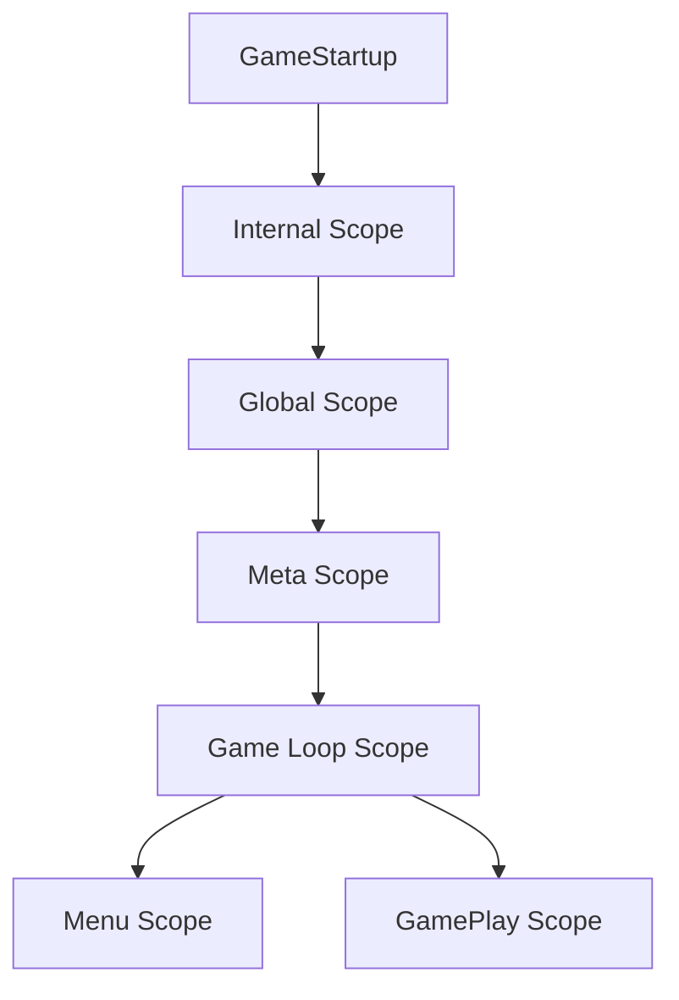
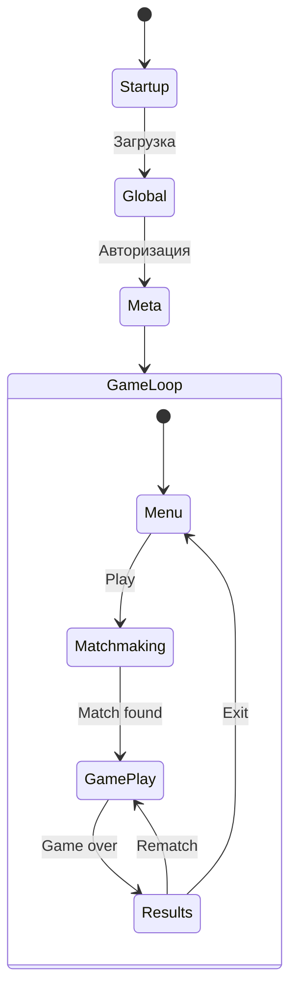

# Клиент: сцены и DI

Стек и загрузка скоупов живут в `client/Assets/Common`. Разбор слоёв Common: [[client-common|Клиент: Common]]. Редакторные генераторы: [[client-dev-tools|инструменты разработки]].

## Стек технологий

| Технология | Назначение |
|-----------|-----------|
| Unity3D | Игровой движок |
| Свой контейнер | DI: `ContainerBuilder` + Roslyn-сгенерированный `IContainer` |
| UniTask | Async/await |
| Кастомный реактивный фреймворк | EventSource, ViewableProperty, ViewableList |
| Lifetime | Управление подписками |

VContainer в продакшн-скоупах нет. Он остался в `Internal.Tests` как baseline бенчмарка.

---

## Иерархия скоупов



Каждый скоуп — свой сгенерированный контейнер. Дочерний наследует резолв родителя. Корень задаётся методом `Construct` (не лямбдой) и атрибутом `[ContainerScopeParent]`.

Моки (`MenuMock`, `GameMock`) поднимают Internal → Global → Meta и **не** создают GameLoop.

---

## Скоупы подробно

### Internal Scope
**Файл:** `client/Assets/Common/Internal/Runtime/Scopes/Services/InternalScopeExtensions.cs` (`LoadInternal`: обычный `ServiceScopeLoader.Load` без родителя)

Корневой скоуп без сцены. группа `InternalAssets` (опции), регистрация `IServiceScopeLoader`, `IEntityScopeLoader`, `StartupAssetsPreload`, `OptionsContainer`.

### Global Scope
**Файл:** `client/Assets/Common/Global/Setup/GlobalScopeExtensions.cs`

Runtime-сцена `Global_Services`. Базовая инфраструктура:
- Audio, Camera, Input, Updater
- BackendClient (HTTP REST)
- Settings, Publisher (Itch)
- UI (загрузочные экраны, `UIStateMachine`)

### Meta Scope
**Файл:** `client/Assets/Meta/MetaScopeExtensions.cs`

Авторизация и подключение к бэкенду:
- Authentication, user state
- MetaBackend (WebSocket)
- Matchmaking, cards registry

### Menu Scope
**Файл:** `client/Assets/Menu/Common/MenuScopeExtensions.cs`

Главное меню: навигация, play, колоды, social. Сцены грузятся через каталог `Scenes.*` и `SceneServicesFactory`.

### GamePlay Scope
**Файл:** `client/Assets/GamePlay/Loop/GamePlayScopeExtensions.cs`

Активный геймплей: доска, игроки, карты, sync, UI overlays. Сессионная сеть — `AddSessionServices()`.

---

## Паттерн сервиса на сцене

`ISceneService` — только регистрация в DI:

```
MonoBehaviour + ISceneService
  └── Create(IScopeBuilder) — регистрация
```

Setup — отдельные интерфейсы (`IScopeSetup`, async-варианты, Loaded, Dispose). Их резолвит `EventLoop` **после** сборки контейнера.

`SceneServicesFactory` на сцене держит сериализованный список сервисов. Список обновляет `Assets/Scan services` (`Ctrl+E`), в рантайме автопоиска нет.

Сгенерированные Hierarchy Bindings могут сами быть `ISceneService` / `IEntityComponent`, если при генерации стоят галочки.

---

## Поток навигации



### GameLoop
**Файл:** `client/Assets/Common/Flow/Loop/GameLoop.cs`

Контроллер верхнего уровня:
- `MenuLoader` — загрузка меню
- `GamePlayLoader` — загрузка геймплея
- `GameLoopScopeLoader` — сначала unload предыдущего скоупа (имена сцен пересекаются)

---

## Реактивные паттерны

### EventSource (события)
```
_event.Invoke(value)              // Отправить
_event.Advise(lifetime, handler)  // Подписаться (только будущие)
```

### ViewableProperty (состояние)
```
_prop.Set(value)                  // Обновить
_prop.View(lifetime, handler)     // Подписаться (текущее + будущие)
```

### ViewableList (коллекция)
```
_list.Add(item)                   // Добавить
_list.Remove(item)                // Удалить (terminates item.Lifetime)
_list.View(lifetime, item => ...) // Подписаться на элементы
```

### Правила подписок
- **View()** для UI (получает текущее значение сразу)
- **Advise()** для событий (только будущие)
- **Каждая подписка требует Lifetime** — иначе утечка памяти
- В коллекциях использовать `item.Lifetime` для per-item подписок

---

## Ключевые файлы

| Файл | Описание |
|------|----------|
| `client/Assets/Common/Flow/Startup/GameStartup.cs` | Точка входа |
| `client/Assets/Common/Flow/Loop/GameLoop.cs` | Контроллер меню/геймплей |
| `client/Assets/Common/Global/Setup/GlobalScopeExtensions.cs` | Регистрация Global |
| `client/Assets/Meta/MetaScopeExtensions.cs` | Регистрация Meta |
| `client/Assets/Menu/Common/MenuScopeExtensions.cs` | Регистрация Menu |
| `client/Assets/GamePlay/Loop/GamePlayScopeExtensions.cs` | Регистрация GamePlay |
| `client/Assets/Common/Internal/Runtime/Scopes/Services/SceneServices/ISceneService.cs` | Интерфейс сервиса сцены |
| `client/Assets/Common/Internal/Runtime/Scopes/Services/SceneServices/SceneServicesFactory.cs` | Фабрика сервисов |
| `client/Assets/Common/Internal/Runtime/Scopes/Services/ScopeContainer.cs` | Создание сгенерированного контейнера |
