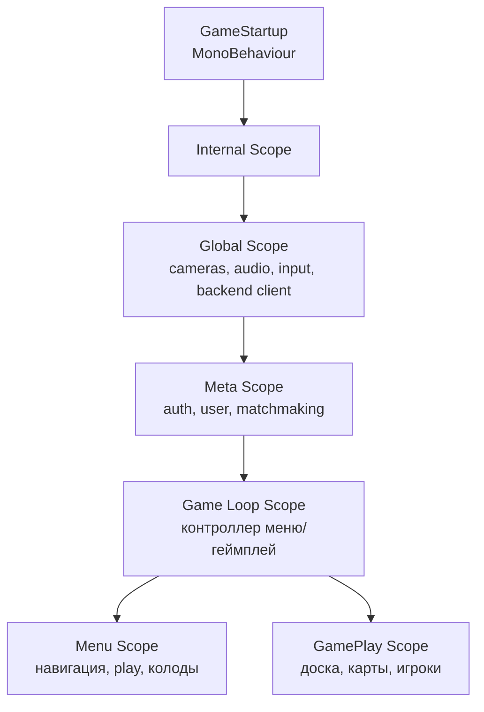
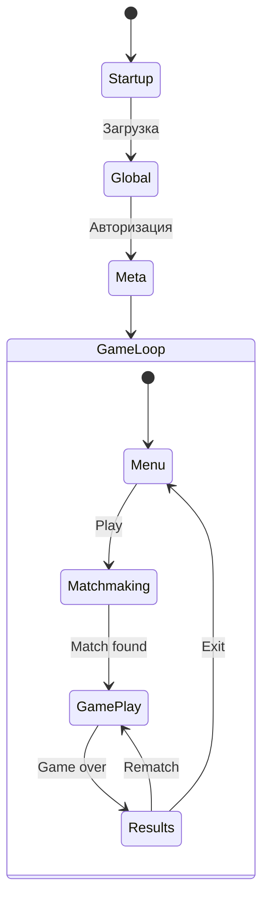

# Клиент: сцены и DI

## Стек технологий

| Технология | Назначение |
|-----------|-----------|
| Unity3D | Игровой движок |
| VContainer | Dependency Injection |
| UniTask | Async/await |
| Кастомный реактивный фреймворк | EventSource, ViewableProperty, ViewableList |
| Lifetime | Управление подписками |

---

## Иерархия скоупов



Каждый скоуп — отдельный VContainer `LifetimeScope`. Дочерние скоупы наследуют зависимости от родительских.

---

## Скоупы подробно

### Global Scope
**Файл:** `client/Assets/Global/Setup/GlobalServicesScene.cs`

Загружается первым при старте. Предоставляет базовую инфраструктуру:
- Audio, Camera, Input
- BackendClient (HTTP REST)
- Settings
- UI-система (загрузочные экраны)

### Meta Scope
**Файл:** `client/Assets/Meta/Setup/MetaServicesScene.cs`

Обрабатывает авторизацию и подключение к бэкенду:
- Authentication
- User state
- MetaBackend (WebSocket-соединение)
- Matchmaking
- Cards registry

### Menu Scope
**Файлы:** `client/Assets/Menu/Common/Setup/MenuServicesScene.cs`, `MenuUIScene.cs`

Главное меню:
- `MenuLoop` — контроллер меню
- `MenuNavigation` — навигация между экранами
- `MenuPlay` — выбор режима и поиск игры
- `MenuDecks` — управление колодами
- Social features

### GamePlay Scope
**Файлы:** `client/Assets/GamePlay/Loop/Scenes/GameServicesScene.cs`, `GameFieldScene.cs`

Активный геймплей:
- Board (доска, клетки, выбор)
- Players (здоровье, мана, ходы)
- Cards (рука, колода, действия карт)
- Sync (синхронизация состояний)
- UI overlays (раунд, пауза, конец игры)

---

## Паттерн MonoBehaviour-сервиса

Каждый сервис в сцене реализует:

```
MonoBehaviour + ISceneService + IScopeSetup
  ├── Create(IScopeBuilder) — регистрация в DI
  └── OnSetup(IReadOnlyLifetime) — инициализация подписок
```

`SceneServicesFactory` автоматически находит все `ISceneService` в сцене и вызывает `Create()`, затем `OnSetup()`.

---

## Поток навигации



### GameLoop
**Файл:** `client/Assets/Loop/GameLoop.cs`

Контроллер верхнего уровня. Переключает между:
- `MenuLoader` — загрузка сцены меню
- `GamePlayLoader` — загрузка сцены геймплея

---

## Реактивные паттерны

### EventSource (события)
```
_event.Invoke(value)              // Отправить
_event.Advise(lifetime, handler)  // Подписаться (только будущие)
```

### ViewableProperty (состояние)
```
_prop.Set(value)                  // Обновить
_prop.View(lifetime, handler)     // Подписаться (текущее + будущие)
```

### ViewableList (коллекция)
```
_list.Add(item)                   // Добавить
_list.Remove(item)                // Удалить (terminates item.Lifetime)
_list.View(lifetime, item => ...) // Подписаться на элементы
```

### Правила подписок
- **View()** для UI (получает текущее значение сразу)
- **Advise()** для событий (только будущие)
- **Каждая подписка требует Lifetime** — иначе утечка памяти
- В коллекциях использовать `item.Lifetime` для per-item подписок

---

## Ключевые файлы

| Файл | Описание |
|------|----------|
| `client/Assets/Startup/GameStartup.cs` | Точка входа |
| `client/Assets/Loop/GameLoop.cs` | Контроллер меню/геймплей |
| `client/Assets/Global/Setup/GlobalScopeExtensions.cs` | Регистрация Global |
| `client/Assets/Meta/Setup/MetaScopeExtensions.cs` | Регистрация Meta |
| `client/Assets/Menu/Common/Setup/MenuScopeExtensions.cs` | Регистрация Menu |
| `client/Assets/GamePlay/Loop/PvP/PvPScopeExtensions.cs` | Регистрация GamePlay |
| `client/Assets/Internal/Scopes/Services/SceneServices/ISceneService.cs` | Интерфейс сервиса |
| `client/Assets/Internal/Scopes/Services/SceneServices/SceneServicesFactory.cs` | Фабрика сервисов |
