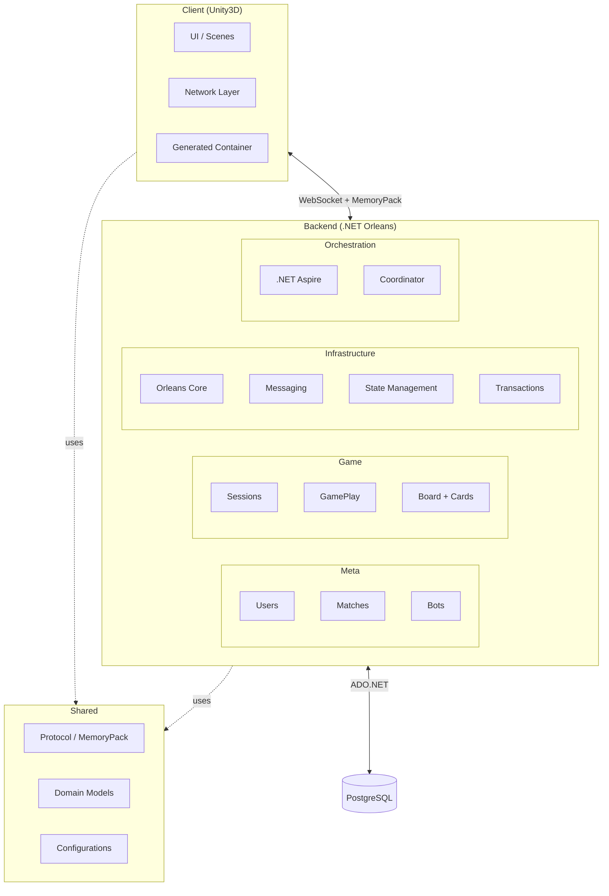
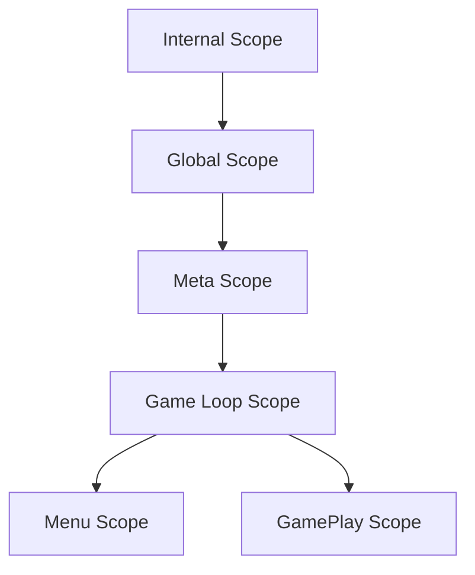
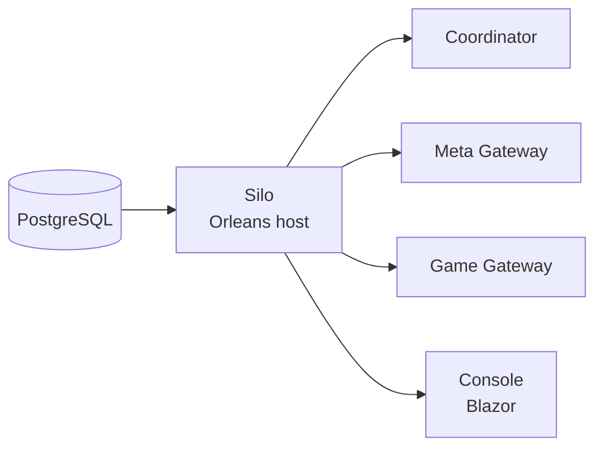
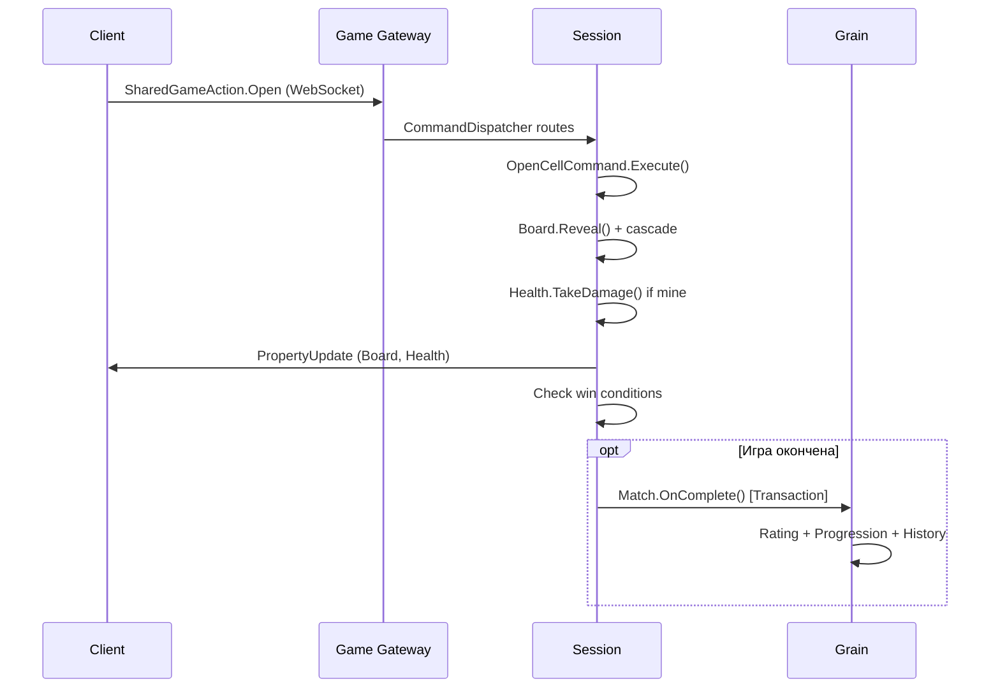

# Общая архитектура

## Три слоя

---

## Клиент (Unity3D)

| Компонент | Технология | Описание |
|-----------|-----------|----------|
| DI | Свой контейнер (Roslyn codegen) | `ContainerBuilder` + сгенерированный `IContainer`; VContainer только в бенчмарках |
| Сервисы | MonoBehaviour + ISceneService | Регистрация в скоупе через `Create()`; setup — отдельные `IScopeSetup*` |
| Реактивность | EventSource / ViewableProperty / ViewableList | Наблюдаемые события и состояния |
| Ресурсы | Lifetime | Управление подписками и очисткой |
| Async | UniTask | Асинхронные операции |
| Сеть | WebSocket + MemoryPack | Бинарный протокол |

### Скоупы (Scopes)

| Скоуп | Назначение | Сервисы |
|-------|-----------|---------|
| **Internal** | Корень DI, каталог ассетов, лоадеры скоупов | ServiceScopeLoader, ServiceScopeSceneLoader, Options |
| **Global** | Глобальная инфраструктура | Audio, Camera, Input, BackendClient, Settings |
| **Meta** | Авторизация и пользователь | Auth, User, MetaBackend, Matchmaking |
| **Menu** | Главное меню | MenuLoop, Navigation, Social, Decks |
| **GamePlay** | Активная игра | Board, Players, Cards, Sync, UI |

Подробнее: [[client-scenes|Клиент: сцены]], [[client-common|Клиент: Common]], [[client-dev-tools|инструменты разработки]]

---

## Бэкенд (.NET Orleans)

### Проекты (подпапки backend/)

| Проект | Назначение |
|--------|-----------|
| `Game/` | Игровые сессии, геймплей, доска, карты, бот |
| `Meta/` | Пользователи, матчи, рейтинг, прогрессия, колоды |
| `Infrastructure/` | Orleans-ядро: стейты, транзакции, messaging |
| `Orchestration/` | Aspire, конфигурация, запуск кластера |
| `Common/` | Общие утилиты, StatesLookup |
| `Tests/` | Тесты |
| `Cluster/` | Конфиг-стейты кластера |

### Сервисы Aspire

| Сервис | Роль |
|--------|------|
| **Silo** | Хост Orleans грейнов |
| **Coordinator** | Настройка кластера, конфиги, боты |
| **Meta Gateway** | REST API для авторизации, матчмейкинга |
| **Game Gateway** | WebSocket-сервер для игровых сессий |
| **Console** | Админ-панель (Blazor) |

Порядок запуска: Silo -> (Coordinator, Meta, Game, Console) параллельно.

### Грейны

7 основных грейнов. Подробнее: [[backend-grains|Orleans грейны]]

### Messaging

3 паттерна обмена сообщениями. Подробнее: [[backend-messaging|Messaging]]

### Транзакции

Кастомные ACID-транзакции. Подробнее: [[backend-transactions|Транзакции]]

---

## Shared

Общие модели и протоколы, используемые клиентом и бэкендом:

| Группа | Содержимое |
|--------|-----------|
| `Domain/` | Enums: CardType, GameMatchType, SessionType, CharacterType |
| `Protocol/` | Базовые сетевые сообщения, union types, MemoryPack |
| `Backend/` | Протоколы: авторизация, матчмейкинг, проекции |
| `Session/` | Протоколы: сессия, игроки, объекты |
| `Game/` | Модели: доска, клетки, карты, состояния, снапшоты |
| `Configs/` | Конфигурации: карты, режимы, боты, рейтинг |

Подробнее: [[shared-protocol|Shared протокол]]

---

## Поток данных: от клика до обновления

