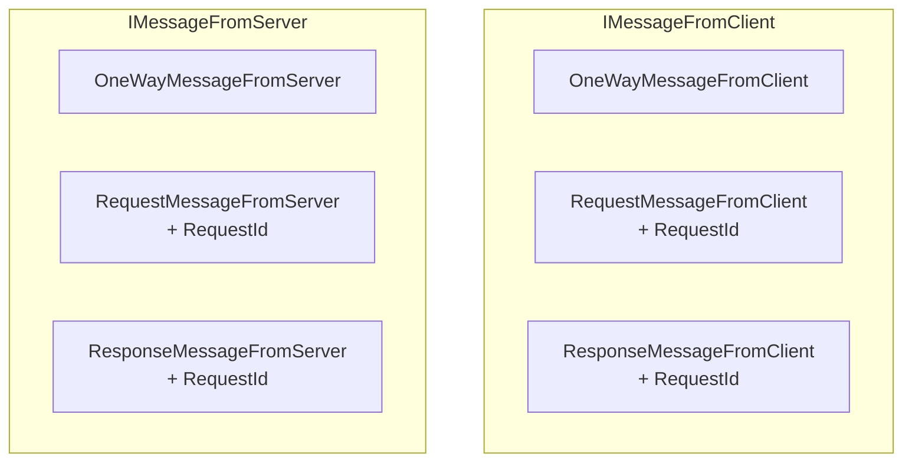

# Shared протокол

Общий код между клиентом и бэкендом. Определяет модели данных, сетевые протоколы и конфигурации.

## Структура shared/

```
shared/
├── Domain/          — Enums (CardType, GameMatchType, SessionType, CharacterType)
├── Protocol/        — Базовые сетевые типы, union builder, MemoryPack
├── Backend/         — Протоколы Meta Gateway (auth, matchmaking, projections)
├── Session/         — Протоколы Game Gateway (session auth, players, objects)
├── Game/            — Игровые модели (board, cells, cards, player states, snapshots)
└── Configs/         — Конфигурации (cards, game modes, bots, rating)
```

---

## Domain Enums

### GameMatchType
```
Single = 10         — PvE (тренировка)
TimeLimited = 20    — PvP с индивидуальным таймером
LastManStanding = 30 — PvP с общим таймером
```

### CardType
10 карт (100-1010), каждая с обычной и Max версией. Подробнее: [[cards|Карточки]]

### SessionType
```
Lobby — Ожидание (динамическое число игроков)
Match — Матч (2 игрока)
```

### CharacterType
```
BOMJ, BIBA, BOBA, CHENOSOS
```

---

## Сериализация: MemoryPack

Весь сетевой обмен использует **MemoryPack** — бинарный формат с высокой производительностью.

### Union Types
Полиморфная сериализация через `IUnionBuilder<T>`:

```csharp
// Базовый интерфейс — union type
public interface ICardUsePayload { }

// Конкретные типы регистрируются в UnionBuilder
CardUsePayload.Trebuchet
CardUsePayload.Bloodhound
CardUsePayload.ZipZap
// ...
```

`DynamicUnionFormatter<T>` обеспечивает автоматическую (де)сериализацию нужного подтипа.

---

## Сетевые протоколы

### Базовые сообщения (Protocol/)



### Backend протоколы (Backend/)

| Контекст | Описание |
|----------|----------|
| `SharedBackendUserSignUp` | Регистрация (POST /develop_signup) |
| `SharedBackendUserLogin` | Логин (POST /login) |
| `SharedBackendSocketAuth` | WebSocket-аутентификация (UserId -> IsSuccess) |
| `SharedMatchmaking.*` | Поиск, создание матча, результат |
| `SharedBackendUser.*` | Проекции: Profile, Progression, Deck, Rating, Match |
| `SharedBackendProjection` | Обёртка для проекций |

### Session протоколы (Session/)

| Контекст | Описание |
|----------|----------|
| `SharedSessionAuth` | Аутентификация сессии (UserId + SessionId) |
| `SharedSessionPlayer.*` | LocalUpdate, RemoteUpdate, RemoteDisconnect |
| `SharedSessionObject.*` | SetProperty, PropertyUpdate, Event |

### Game протоколы (Game/)

| Контекст | Описание |
|----------|----------|
| `SharedGameAction.Open` | Открыть клетку |
| `SharedGameAction.OpenMultiple` | Chord click |
| `SharedGameAction.SetFlag` | Поставить флаг |
| `SharedGameAction.RemoveFlag` | Снять флаг |
| `SharedGameAction.CardUse` | Использовать карту |
| `SharedGameAction.SkipTurn` | Пропустить ход |

---

## Игровые модели

### Состояния игрока

| Модель | Поля | Описание |
|--------|------|----------|
| `PlayerHealthState` | Current, Max | Здоровье |
| `PlayerManaState` | Current, Max | Мана |
| `PlayerMovesState` | Left, Max, IsAvailable | Ходы |
| `PlayerDeckState` | Queue (List\<CardType\>) | Колода |
| `PlayerHandState` | Entries (List\<ActiveCard\>) | Рука |
| `PlayerStashState` | Count | Сброс |
| `PlayerModifiersState` | Dictionary\<Modifier, float\> | Модификаторы |

### Состояние раунда

| Модель | Режим | Поля |
|--------|-------|------|
| `GameRoundState` | Базовый | CurrentPlayer, SecondsLeft |
| `TimeLimitedRoundState` | TimeLimited | CurrentPlayer, SecondsLeft per player |
| `LastManStandingRoundState` | LastManStanding | CurrentPlayer, CurrentRound, SecondsLeft |

### Доска

| Модель | Поля | Описание |
|--------|------|----------|
| `BoardState` | Mines, Flags | Счётчики |
| `Position` | x, y | Координата (struct) |
| `BoardSnapshotRecord.*` | CellTaken, CellFree, Flag, MinesAround, Explosion, Effect* | Снапшоты изменений |

### Карты

| Модель | Описание |
|--------|----------|
| `ActiveCard` | Id (Guid) + Type (CardType) |
| `ICardUsePayload` | Базовый payload (union type) |
| `IBoardCardUsePayload` | + Position для карт по доске |
| `CardActionSnapshot.*` | Снапшоты результатов карт |
| `PatternShapes` | Генерация ромбовидных паттернов |
| `PlayerModifier` | Enum модификаторов (TrebuchetBoost) |

---

## Конфигурации

| Конфиг | Содержимое |
|--------|-----------|
| `CardConfigOptions` | Мана, цель, размер для каждой карты |
| `GameModeOptions` | HP, ходы, мана, время для каждого режима |
| `BotConfigOptions` | Задержки, лимиты действий бота |
| `RatingOptions` | Очки за победу/поражение |
| `ProgressionOptions` | XP за победу/поражение |
| `BoardOptions` | Размер поля (16), мин (40) |

---

## Ключевые файлы

| Файл | Описание |
|------|----------|
| `shared/Domain/*.cs` | Все domain enums |
| `shared/Protocol/Messages.cs` | Базовые сетевые типы |
| `shared/Protocol/UnionBuilder.cs` | Полиморфная сериализация |
| `shared/Backend/SharedMatchmaking.cs` | Протокол матчмейкинга |
| `shared/Session/SharedSessionObject.cs` | Синхронизация объектов |
| `shared/Game/SharedGameAction.cs` | Все игровые действия |
| `shared/Game/Player/*.cs` | Состояния игрока |
| `shared/Game/Cards/*.cs` | Модели карт |
| `shared/Configs/*.cs` | Все конфигурации |
