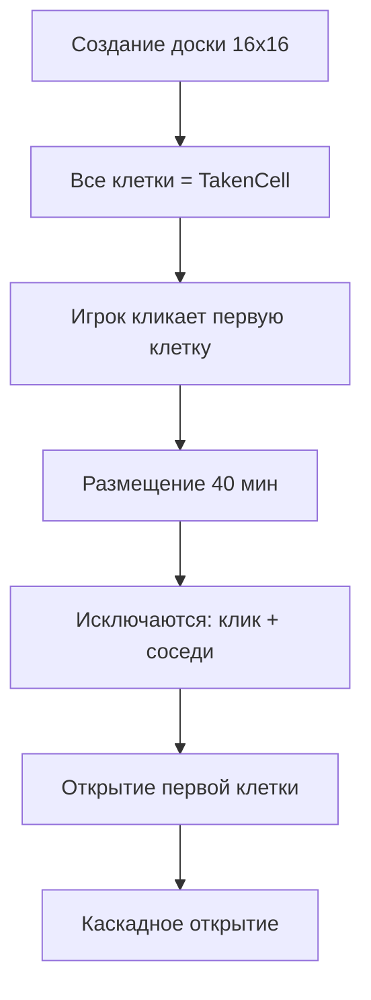
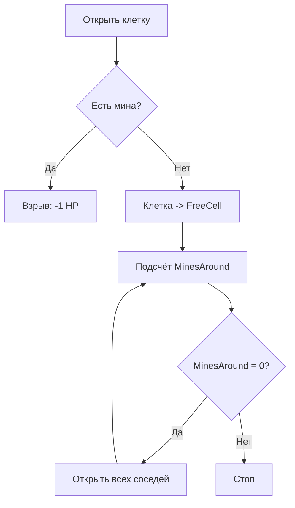

# Игровое поле

## Параметры доски

| Параметр | Значение |
|----------|----------|
| Размер | 16 x 16 (256 клеток) |
| Мин | 40 |
| Первый клик | Всегда безопасен (мины размещаются после) |

## Типы клеток

### TakenCell (закрытая)
Клетка, которую игрок ещё не открыл.

| Свойство | Описание |
|----------|----------|
| `HasMine` | Содержит мину |
| `IsFlagged` | Помечена флагом игрока |
| `Effects` | Список активных эффектов (например, Smoke) |

Операции:
- `SetFlag()` / `RemoveFlag()` — установка/снятие флага
- `Explode()` — взрыв при попадании на мину
- `SetMine()` — установка мины при генерации

### FreeCell (открытая)
Клетка, которая была открыта и безопасна.

| Свойство | Описание |
|----------|----------|
| `MinesAround` | Количество мин в 8 соседних клетках |

---

## Генерация поля



1. Все 256 клеток создаются как `TakenCell` (закрытые)
2. Мины **не** размещаются до первого клика
3. При первом клике: 40 мин размещаются случайно, избегая кликнутую клетку и её соседей
4. Первая клетка открывается, запуская каскад

---

## Каскадное открытие (BoardRevealer)

Когда игрок открывает клетку:



Алгоритм рекурсивно открывает соседние клетки, если у текущей `MinesAround = 0`. Это классическая механика сапёра — клик на пустую область открывает всю связанную область до границы с минами.

### "Невалидные" свободные клетки
После открытия `BoardRevealer` проверяет "invalid free cells" — открытые клетки с 0 минами вокруг, у которых есть закрытые соседи. Такие клетки автоматически раскрывают соседей, предотвращая "мёртвые зоны".

---

## Chord Click (OpenMultiple)

Когда игрок кликает на открытую клетку (FreeCell), число флагов вокруг которой равно `MinesAround`:

1. Открываются все незафлагованные закрытые соседи
2. Если незафлагованная клетка содержит мину — **взрыв, -1 HP** за каждую
3. Мины конвертируются в открытые, запускается каскад

Это быстрый способ открыть несколько клеток, если игрок уверен в расстановке флагов.

---

## Действия с клетками

| Действие | Стоимость хода | Описание |
|----------|---------------|----------|
| Open | 1 | Открыть закрытую клетку |
| OpenMultiple | 1 | Chord click на открытой клетке |
| SetFlag | 0 | Поставить флаг (метаданные) |
| RemoveFlag | 0 | Снять флаг |

---

## Подсчёт мин (BoardMinesScanner)

При каждом изменении доски (`Board.Updated`):
- Пересчитывается `MinesAround` для всех открытых клеток
- Обновляется общий счётчик мин и флагов в `BoardState`

```
BoardState:
  Mines: int    // Оставшихся мин
  Flags: int    // Установленных флагов
```

---

## Эффекты клеток

| Эффект | Код | Источник | Описание |
|--------|-----|----------|----------|
| Smoke | 100 | Карта Smoke | Скрывает содержимое на N раундов |

Эффекты хранятся как список на каждой клетке. Каждый эффект имеет `EffectId` для адресного удаления.

## Ключевые файлы

| Файл | Описание |
|------|----------|
| `shared/Game/Options/BoardOptions.cs` | Параметры доски (16x16, 40 мин) |
| `shared/Game/Position.cs` | Структура позиции (x, y) |
| `shared/Game/Context/BoardState.cs` | Состояние доски (мины, флаги) |
| `shared/Game/Cells.cs` | Enum эффектов клеток |
| `backend/Game/GamePlay/Board/Board.cs` | Модель доски |
| `backend/Game/GamePlay/Board/BoardGenerator.cs` | Генерация мин |
| `backend/Game/GamePlay/Board/BoardRevealer.cs` | Каскадное открытие |
| `backend/Game/GamePlay/Board/BoardMinesScanner.cs` | Подсчёт мин |
| `backend/Game/GamePlay/Board/Cell.cs` | Типы клеток |
