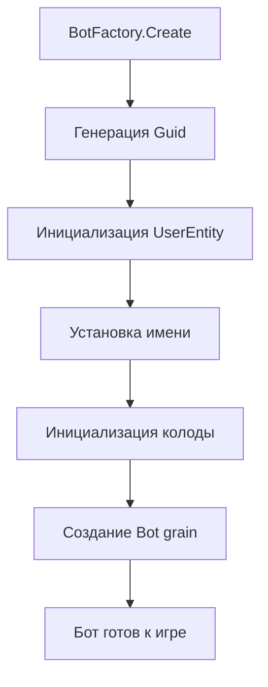
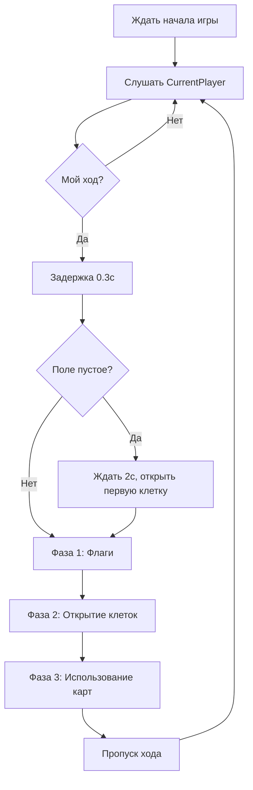

# Бот-система

AI-противник для режима Single (тренировка).

## Конфигурация бота

| Параметр | Значение | Описание |
|----------|----------|----------|
| `ActionDelay` | 0.3с | Задержка между действиями ("думает") |
| `FlagsPerRound` | 3 | Максимум флагов за ход |
| `CellsOpenPerRound` | 3 | Максимум открытий клеток за ход |
| `CardsUsePerRound` | 2 | Максимум использований карт за ход |
| `MatchmakingApplyThreshold` | 20 | Порог для матчмейкинга |

Конфигурация: `BotConfigOptions` (`shared/Configs/BotConfigOptions.cs`)

---

## Создание бота (BotFactory)

Бот создаётся как полноценный пользователь с колодой карт, чтобы игровая логика обрабатывала его одинаково с реальными игроками.

---

## Цикл хода бота (BotRunner)

### Фаза 1: Установка флагов
- До 3 флагов за ход
- Использует `BotFlagAction.TryExecute()`
- Ставит флаги на клетки, которые бот считает заминированными

### Фаза 2: Открытие клеток
- До 3 открытий за ход
- Использует `BotCellAction.TryExecute()`
- Открывает случайные закрытые клетки

### Фаза 3: Использование карт
- До 2 карт за ход
- Использует `BotCardAction.TryExecute()`
- Каждый тип карты имеет свою стратегию

---

## Стратегии карт

Каждая карта имеет отдельный класс стратегии в `Bot/CardStrategies/`:

| Карта | Стратегия | Логика |
|-------|-----------|--------|
| Bloodhound | `BloodhoundStrategy` | Ищет области с минами |
| Trebuchet | `TrebuchetStrategy` | Выбирает позицию на поле врага |
| Flag Erase | `OpponentFlagEraseStrategy` | Ищет области с флагами врага |
| Smoke | `SmokeStrategy` | Покрывает открытые области |
| Erosion Dozer | -- | Выбирает кластер закрытых клеток |
| Zip Zap | -- | Целится в область с минами |
| Opponent Bomb | -- | Выбирает случайную клетку |
| Flag Reshuffle | -- | Целится в область с флагами |

---

## Утилиты анализа доски (BotBoardUtils)

| Метод | Описание |
|-------|----------|
| `FindRandomClosedCell()` | Случайная закрытая клетка |
| `FindClosestUnflaggedMine()` | Ближайшая известная мина без флага |
| `FindRandomTakenPosition()` | Случайная занятая позиция |
| `FindRandomFlaggedPosition()` | Случайная помеченная позиция |
| `HasFlaggedCells()` | Есть ли флаги на поле |

---

## Готовность бота

Для PvE используется `BotGameReadyAwaiter` вместо `GameReadyAwaiter`:
- Ждёт только 1 реального игрока
- Бот мгновенно подтверждает готовность

## Ключевые файлы

| Файл | Описание |
|------|----------|
| `shared/Configs/BotConfigOptions.cs` | Конфигурация бота |
| `backend/Meta/Bots/BotFactory.cs` | Создание бота |
| `backend/Meta/Bots/BotEntity.cs` | Grain бота |
| `backend/Game/GamePlay/Bot/BotRunner.cs` | Цикл хода бота |
| `backend/Game/GamePlay/Bot/BotBoardUtils.cs` | Утилиты анализа |
| `backend/Game/GamePlay/Bot/Actions/BotCellAction.cs` | Открытие клеток |
| `backend/Game/GamePlay/Bot/Actions/BotFlagAction.cs` | Установка флагов |
| `backend/Game/GamePlay/Bot/Actions/BotCardAction.cs` | Использование карт |
| `backend/Game/GamePlay/Bot/CardStrategies/*.cs` | Стратегии карт |
