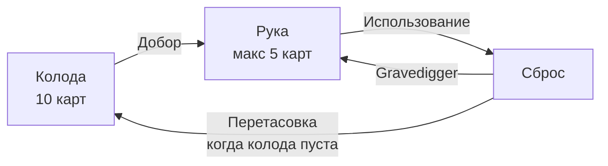

# Карточки

Уникальные карты, каждая с обычной и Max (улучшенной) версией там, где применимо. Карты тратят ману и одно действие.

## Обзор карт

| Карта | Мана | Цель | Размер | Эффект |
|-------|------|------|--------|--------|
| Trebuchet | 3 | Поле врага | 4 | Устанавливает мины ромбом |
| Bloodhound | 2 | Своё поле | 4 | Очищает и открывает клетки |
| Trebuchet Aimer | 2 | Себя | -- | Усиливает следующий Trebuchet |
| Erosion Dozer | 4 | Своё поле | 5 | Очищает связанные клетки |
| Gravedigger | 4 | Себя | -- | Возвращает карту из сброса |
| Zip Zap | 3 | Своё поле | 3 | Цепная молния по минам |
| Opponent Bomb | 2 | Поле врага | -- | Открывает 1 клетку, урон если мина |
| Flag Erase | 3 | Поле врага | 3 | Убирает флаги в области |
| Flag Reshuffle | 2 | Поле врага | 3 | Перемешивает флаги |
| Smoke | 3 | Поле врага | 3 | Затуманивает клетки на 3 раунда |
| Medic | 4 | Себя | -- | Восстанавливает 1 HP |
| Minefield Scout | 3 | Своё поле | 5 | Открывает линию клеток, флажит мины |
| Siphon | 2 | Противник | -- | Уменьшает макс. ману противника, увеличивает свою |
| Chain Reaction | 4 | Поле врага | -- | Находит до 3 мин, спавнит мины ромбом вокруг каждой |
| Overclock | 3 | Себя | -- | +2 дополнительных действия в этом ходу |
| Fog of War | 3 | Поле врага | 4 | Скрывает цифры на открытых клетках на 2 раунда |
| Scavenger | 2 | Себя | -- | Берёт 2 карты из колоды сверх лимита |
| Hand Scramble | 3 | Противник | -- | Возвращает руку противника в колоду и перетасовывает |

---

## Подробное описание

### Trebuchet
> Мана: 3 | Цель: поле противника | Паттерн: ромб (размер 4)

Устанавливает мины в ромбовидной области на поле противника. Усиливается модификатором `TrebuchetBoost` от Trebuchet Aimer.

```
    *
   * *
  * * *
 * * * *
  * * *
   * *
    *
```

### Bloodhound
> Мана: 2 | Цель: своё поле | Паттерн: ромб (размер 4)

Очищает занятые (taken) клетки в области ромба — снимает флаги и открывает их. Полезно для безопасного разминирования своего поля.

### Trebuchet Aimer
> Мана: 2 | Цель: себя | Без позиции

Добавляет +1 к модификатору `TrebuchetBoost`. Каждый буст увеличивает эффект Trebuchet на 2 дополнительных клетки. Сбрасывается после использования Trebuchet. Можно накапливать несколько раз.

### Erosion Dozer
> Мана: 4 | Цель: своё поле | Лимит: 5 клеток

Очищает до 5 связанных занятых клеток, начиная от позиции клика. Выбирает ближайшие клетки. Полезно для быстрого открытия большой области.

### Gravedigger
> Мана: 4 | Цель: себя | Без позиции

Берёт последнюю карту из сброса (stash) и добавляет обратно в руку. Позволяет повторно использовать ценные карты.

### Zip Zap
> Мана: 3 | Цель: своё поле | Цепь: 3 мины, радиус поиска: 4

Цепная молния, которая уничтожает мины на своём поле. Начинает от позиции клика, находит ближайшую мину в радиусе 4, затем прыгает к следующей ближайшей. Обезвреживает до 3 мин за использование.

### Opponent Bomb
> Мана: 2 | Цель: поле противника | 1 клетка

Открывает одну клетку на поле противника. Если это мина — противник получает 1 урон и мина взрывается. Если нет — клетка просто открывается.

### Flag Erase
> Мана: 3 | Цель: поле противника | Паттерн: ромб (размер 3)

Убирает флаги с помеченных клеток в области ромба. Мешает противнику собирать победу по флагам.

### Flag Reshuffle
> Мана: 2 | Цель: поле противника | Паттерн: ромб (размер 3)

Случайно перераспределяет флаги между помеченными и непомеченными клетками в области. Создаёт хаос на поле противника.

### Smoke
> Мана: 3 | Цель: поле противника | Паттерн: ромб (размер 3) | Длительность: 3 раунда

Накладывает эффект дыма на клетки, скрывая их содержимое на 3 раунда. Эффект автоматически снимается по истечении.

### Medic
> Мана: 4 | Цель: себя | Без позиции

Восстанавливает 1 HP. Не может превысить максимальное значение здоровья.

### Minefield Scout
> Мана: 3 | Цель: своё поле | Паттерн: линия (длина 5)

Открывает линию клеток на своём поле. Мины в линии не взрываются — они получают флаг. Обычные клетки открываются как при обычном нажатии. Выбирает горизонтальную или вертикальную ориентацию в зависимости от того, где больше клеток.

### Siphon
> Мана: 2 | Цель: противник | Без позиции

Уменьшает **максимальную** ману противника на `DrainAmount` и увеличивает свою максимальную ману на то же значение. Постоянный эффект — противник навсегда теряет пропускную способность маны, а вы получаете её. Настраивается через `DrainAmount` в конфиге.

### Chain Reaction
> Мана: 4 | Цель: поле противника | Без размера

Цепочка по минам: находит ближайшую мину в радиусе `SearchRadius` от точки клика, затем от неё — следующую ближайшую, и так далее до `MaxChain` раз. Вокруг каждой найденной мины спавнит дополнительные мины в ромбе `SpawnSize` на закрытых незаминированных клетках. Параметры настраиваются в конфиге.

### Overclock
> Мана: 3 | Цель: себя | Без позиции

Даёт +2 дополнительных действия в текущем ходу. Не переносится на следующий ход.

### Fog of War
> Мана: 3 | Цель: поле противника | Паттерн: ромб (размер 4) | Длительность: 2 раунда

Скрывает цифры (подсказки о минах) на уже открытых клетках противника на 2 раунда. Противник видит клетки открытыми, но без числовых подсказок — ориентироваться становится сложнее.

### Scavenger
> Мана: 2 | Цель: себя | Без позиции

Берёт 2 карты из колоды в руку, игнорируя лимит руки. Позволяет накопить большую руку.

### Hand Scramble
> Мана: 3 | Цель: противник | Без позиции

Возвращает все карты из руки противника в его колоду, перетасовывает колоду и заставляет его взять то же количество карт обратно. Лишает противника заготовленной комбо-руки.

---

## Механика карт

### Колода и рука



- **Колода** — очередь из 10 карт, выбранных игроком перед матчем
- **Рука** — до 5 активных карт, доступных для использования
- **Сброс (Stash)** — использованные карты, переносятся обратно в колоду при её опустошении
- В начале каждого хода рука пополняется до максимума

### Использование карты

1. Игрок выбирает карту из руки
2. Проверка: хватает ли маны и ходов
3. Карта создаётся через `CardFactory` по типу
4. Выполняется `card.Use()` -> `CardUseResult`
5. При успехе: карта удаляется из руки, мана списывается, ход тратится, карта идёт в сброс

### Цели карт (CardTarget)

| Цель | Описание | Карты |
|------|----------|-------|
| `OwnBoard` | Своё минное поле | Bloodhound, Erosion Dozer, Zip Zap, Minefield Scout |
| `OpponentBoard` | Поле противника | Trebuchet, Opponent Bomb, Flag Erase, Flag Reshuffle, Smoke, Chain Reaction, Fog of War |
| `Self` | На себя, без позиции | Trebuchet Aimer, Gravedigger, Medic, Overclock, Scavenger |
| `Opponent` | На противника, без позиции | Siphon, Hand Scramble |

### Паттерны выбора (PatternShapes)

Карты с позицией используют ромбовидный или линейный паттерн:

```
Ромб размер 3:    Ромб размер 4:    Линия длина 5 (горизонталь):
     *                  *               . . . . .
    * *                * *              * * * * *
   * * *              * * *             . . . . .
    * *              * * * *
     *                * * *
                       * *
                        *
```

## Ключевые файлы

| Файл | Описание |
|------|----------|
| `shared/Domain/CardType.cs` | Enum всех типов карт |
| `shared/Configs/CardConfigOptions.cs` | Параметры: мана, цель, размер |
| `shared/Game/Cards/ICardUsePayload.cs` | Payload-интерфейсы для использования |
| `shared/Game/Cards/PatternShapes.cs` | Генерация ромбовидных и линейных паттернов |
| `backend/Game/GamePlay/Cards/ICard.cs` | Интерфейс карты |
| `backend/Game/GamePlay/Cards/CardFactory.cs` | Фабрика создания карт |
| `backend/Game/GamePlay/Cards/*.cs` | Реализации всех карт |
| `backend/Game/GamePlay/Players/Deck.cs` | Логика колоды |
| `backend/Game/GamePlay/Players/Hand.cs` | Логика руки |
| `backend/Game/GamePlay/Players/Stash.cs` | Логика сброса |
