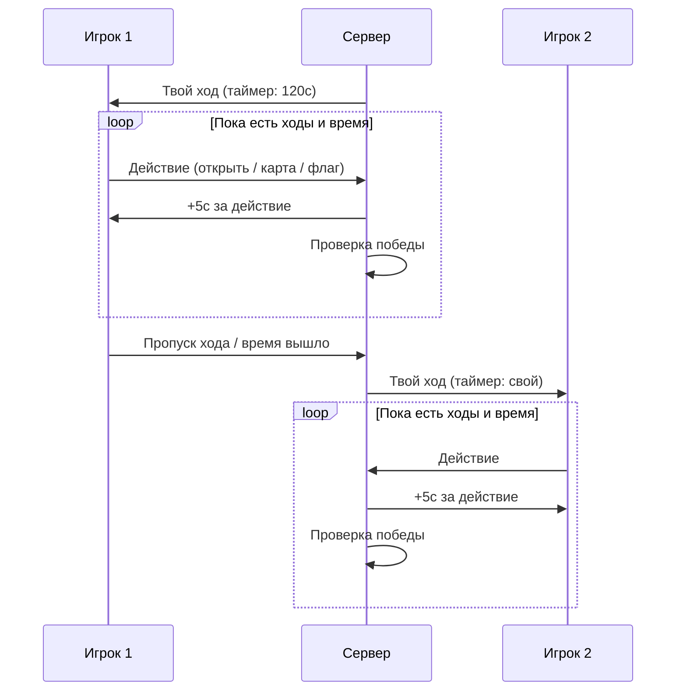
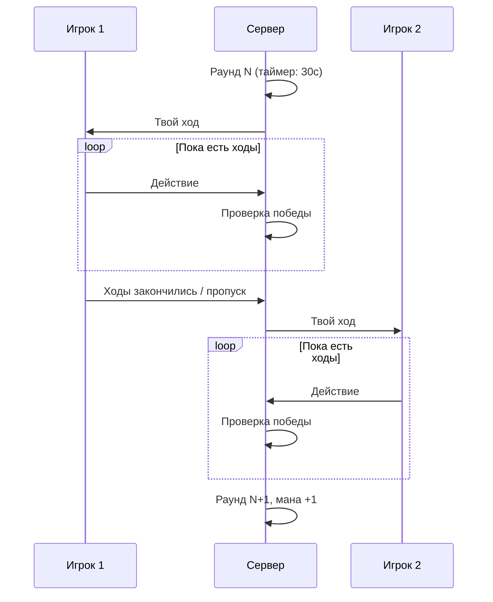

# Игровые режимы

Три режима определены в `GameMatchType`:

## Сравнение режимов

| Параметр | Single | TimeLimited | LastManStanding |
|----------|--------|-------------|-----------------|
| **Тип** | PvE (против бота) | PvP | PvP |
| **Таймер** | Нет | 120с на игрока | 30с общий |
| **Бонус времени** | -- | +5с за действие | -- |
| **HP** | 3 | 3 | 3 |
| **Ходов за раунд** | 5 | 5 | 5 |
| **Стартовая мана** | 1 | 1 | 1 |
| **Рука / Колода** | 5 / 10 | 5 / 10 | 5 / 10 |
| **Поле** | 16x16, 40 мин | 16x16, 40 мин | 16x16, 40 мин |
| **Победа по флагам** | Да | После 2 раундов | После 2 раундов |

---

## Single (Training)

Режим тренировки против AI-бота. Не регистрирует специального `IGameRound` — используется для практики.

- Всегда создаётся через `MatchFactory.CreateWithBot()`
- Тип матча автоматически устанавливается в `GameMatchType.Single`
- Нет ограничений по времени

---

## TimeLimited

Основной PvP-режим с индивидуальными таймерами.

### Механика времени
- Каждый игрок получает **120 секунд** личного времени
- За каждое действие (открытие клетки или использование карты) начисляется **+5 секунд**
- Время тикает только во время хода игрока
- Если время заканчивается — проигрыш

### Поток раунда



### Стратегия
Активная игра вознаграждается: чем больше действий за ход, тем больше накопленного времени. Пассивная игра ведёт к проигрышу по таймеру.

### Состояние раунда
```
TimeLimitedRoundState:
  CurrentPlayer: Guid
  SecondsLeft: Dictionary<Guid, long>  // Персональный таймер каждого
```

---

## LastManStanding

PvP-режим с общим таймером и тактическим фокусом.

### Механика времени
- **30 секунд** на раунд — общий таймер для обоих игроков
- Таймер сбрасывается каждый раунд
- Нет бонуса времени за действия

### Поток раунда



### Рост маны
Максимальная мана увеличивается на **+1 каждый ход**. Это создаёт стратегическую динамику: ранние раунды — открытие клеток, поздние — мощные карточные комбинации.

### Состояние раунда
```
LastManStandingRoundState:
  CurrentPlayer: Guid
  CurrentRound: int
  SecondsLeft: int  // Общий таймер
```

---

## Конфигурация

Параметры режимов хранятся в `config.gameMode.json` и загружаются через `GameModeOptions`:

```json
{
  "LastManStanding": {
    "PlayerHealth": 3,
    "PlayerMoves": 5,
    "PlayerStartMana": 1,
    "RoundTime": 30
  },
  "TimeLimited": {
    "PlayerHealth": 3,
    "PlayerMoves": 5,
    "PlayerStartMana": 1,
    "RoundTime": 120,
    "TimeGainPerAction": 5
  }
}
```

Параметры игрока (размер руки и колоды) хранятся в `config.player.json` и загружаются через `PlayerConfigOptions`:

```json
{
  "HandSize": 5,
  "DeckSize": 10
}
```

## Ключевые файлы

| Файл | Описание |
|------|----------|
| `shared/Domain/GameMatchType.cs` | Enum режимов |
| `shared/Configs/GameModeOptions.cs` | Параметры режимов |
| `shared/Configs/PlayerConfigOptions.cs` | Параметры игрока |
| `backend/Game/GamePlay/Context/Rounds/TimeLimitedRound.cs` | Реализация TimeLimited |
| `backend/Game/GamePlay/Context/Rounds/LastManStandingRound.cs` | Реализация LastManStanding |
| `backend/Game/Global/SessionFactory.cs` | Выбор режима при создании сессии |
| `backend/Orchestration/Coordinator/config.gameMode.json` | JSON-конфиг режимов |
| `backend/Orchestration/Coordinator/config.player.json` | JSON-конфиг игрока |
