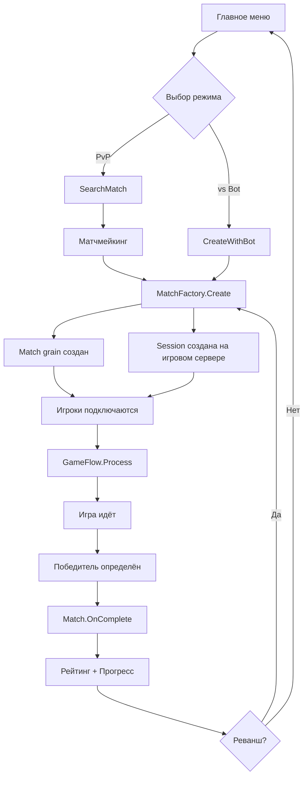
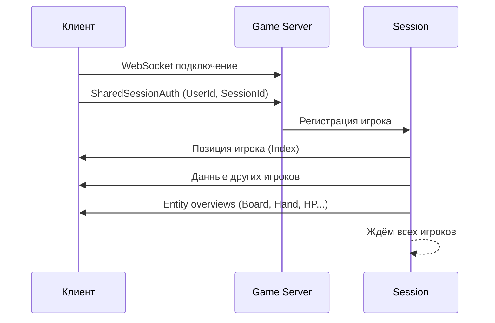
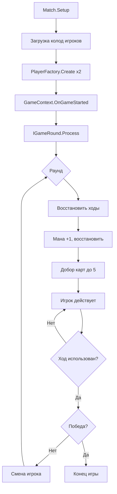
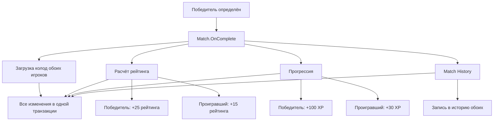

# Цикл матча

Полный жизненный цикл матча: от поиска до результата.

## Общая схема



---

## 1. Поиск игры (Matchmaking)

### Клиент
Игрок выбирает режим в `MenuPlay`:
- **Play** — Single (против бота)
- **Time Limited** — PvP TimeLimited
- **Last Man Standing** — PvP LastManStanding

### Сетевые сообщения

| Сообщение | Направление | Описание |
|-----------|-------------|----------|
| `SearchMatch` | Client -> Server | Поиск PvP матча с типом |
| `CreateWithBot` | Client -> Server | Создание матча с ботом |
| `CancelSearch` | Client -> Server | Отмена поиска |
| `MatchResult` | Server -> Client | Результат: ServerUrl + SessionId |

### Серверная логика
`MatchFactory` координирует создание:
1. Создаёт `Match` grain (Orleans) через `IMatch.Setup()`
2. Отправляет pipe-запрос на случайный игровой сервер для создания сессии
3. Возвращает `MatchResult` обоим участникам

---

## 2. Подключение к сессии



### Session lifecycle
1. Сессия создана с ID и Lifetime
2. `Session.Run()` ожидает подключения игроков (2 для матча)
3. Для каждого игрока:
   - Запускается диспетчер команд
   - Запускается сетевое I/O
   - Отправляются начальные данные
4. Сигнал `AllUsersConnected`

---

## 3. Готовность к игре

`GameReadyAwaiter` ждёт, пока оба игрока подтвердят готовность:
- PvP: ждёт 2 игроков
- PvE: ждёт 1 игрока (бот мгновенно готов)

---

## 4. Игровой процесс (GameFlow)



### Действия игрока за ход

| Действие | Расход | Сеть |
|----------|--------|------|
| Открыть клетку | 1 ход | `SharedGameAction.Open` |
| Chord click | 1 ход | `SharedGameAction.OpenMultiple` |
| Использовать карту | 1 ход + мана | `SharedGameAction.CardUse` |
| Поставить флаг | 0 ходов | `SharedGameAction.SetFlag` |
| Снять флаг | 0 ходов | `SharedGameAction.RemoveFlag` |
| Пропустить | все ходы | `SharedGameAction.SkipTurn` |

### Пополнение карт (RestoreCards)
В начале каждого хода:
1. Пока `hand.count < hand.size` (5):
   - Если колода пуста -> перетасовать сброс обратно в колоду
   - Взять карту из колоды в руку

---

## 5. Завершение матча



### Данные матча (MatchState)
```
MatchState:
  Id: Guid
  Type: GameMatchType
  Participants: Guid[]
  Winner: Guid
  StartDate: DateTime
  Duration: TimeSpan
  ParticipantDecks: Dictionary<Guid, CardType[]>
  RatingChanges: Dictionary<Guid, int>
```

---

## 6. Реванш

После завершения матча:
1. `RematchAwaiter` запускает 30-секундное окно
2. Оба игрока решают: реванш или выход
3. Если оба согласны -> создаётся новый матч
4. Если кто-то отказался -> возврат в меню

---

## 7. Рейтинг и прогрессия

### Рейтинг
| Результат | Изменение |
|-----------|-----------|
| Победа | +25 |
| Поражение | +15 |

Суммарный рейтинг = сумма всех записей. Конфигурируется в `RatingOptions`.

### Прогрессия (XP)
| Результат | Опыт |
|-----------|------|
| Победа | +100 |
| Поражение | +30 |

Конфигурируется в `ProgressionOptions`.

## Ключевые файлы

| Файл | Описание |
|------|----------|
| `shared/Backend/SharedMatchmaking.cs` | Протокол матчмейкинга |
| `shared/Game/SharedGameAction.cs` | Все игровые действия |
| `backend/Meta/Matches/MatchFactory.cs` | Создание матча |
| `backend/Meta/Matches/Match.cs` | Grain матча, завершение |
| `backend/Game/GamePlay/Context/GameFlow.cs` | Основной игровой цикл |
| `backend/Game/GamePlay/Context/GameReadyAwaiter.cs` | Ожидание готовности |
| `backend/Game/GamePlay/Commands/*.cs` | Обработчики команд |
| `backend/Game/Session/Root/Session.cs` | Сессия |
| `client/Assets/Meta/Matchmaking/Matchmaking.cs` | Клиентский матчмейкинг |
| `client/Assets/Menu/Main/Play/MenuPlay.cs` | UI выбора режима |
