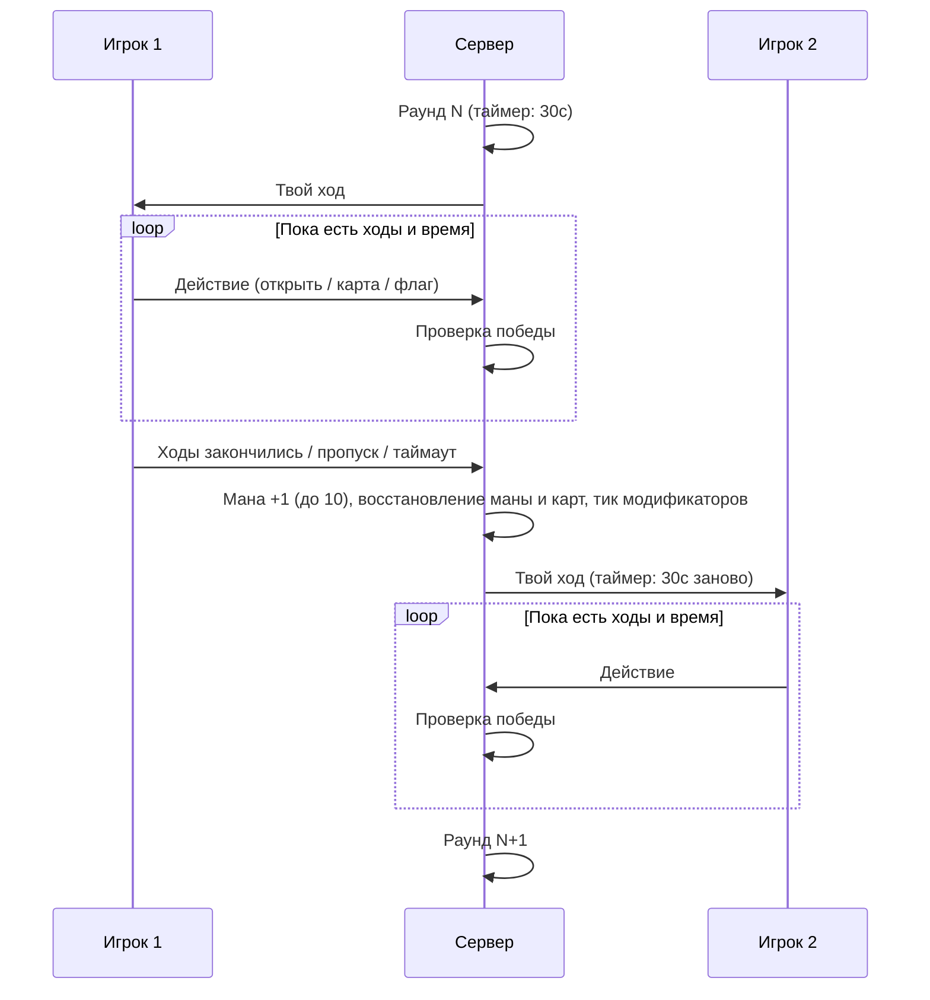

# LastManStanding

PvP-режим с общим таймером на раунд и тактическим фокусом. Реализация — `backend/Game/GamePlay/Context/Rounds/LastManStandingRound.cs`.

## Menu card

Player-facing copy for the mode-select card. Pixel font is wide — keep the title and tagline as-is; pick **short** or **long** body depending on how much room the card has. If the full title wraps, use **Last Stand**.

| Field | Copy |
|-------|------|
| **Title** | Last Man Standing |
| **Short title** | Last Stand |
| **Tagline** | Thirty seconds. No extras. |
| **Short** | Each turn a fresh 30-second clock. No refunds. Mana climbs every round — clear early, detonate late. |
| **Long** | Every turn you get a clean 30-second clock — no bonuses, no leftover time. Mana grows after each of your turns, so the match starts as a clearing race and ends as a card war. Survive the burst. Be the last miner standing. |
| **At a glance** | 30s per turn · no time bonus · mana +1 each turn |

### Icon

`64 × 64` item icon. Steel mine with a red flag on the same flat navy tile as Time Limited.

PixelLab prompt and settings: [[mode-icons|Mode icons]] (icon + empty card frame).

## Параметры

| Параметр | Значение | Источник |
|----------|----------|----------|
| HP | 3 | `LastManStandingModeOptions.PlayerHealth` |
| Ходов за раунд | 5 | `PlayerMoves` |
| Стартовая мана | 1 | `PlayerStartMana` |
| Потолок маны | 10 | `MaxManaCap` |
| Время раунда | 30с | `RoundTime` |
| Стоимость карты в ходах | 0 | `CardMovesCost` |
| Рука / Колода | 5 / 10 | `PlayerConfigOptions` |
| Поле | 16x16, 40 мин | см. [[board]] |

## Механика времени

- **30 секунд** на раунд — таймер отсчитывается для текущего игрока и заново берётся из `RoundTime` в начале каждого раунда.
- Бонуса времени за действия нет.
- Раунд завершается по первому из двух условий: истёк таймер (`TimerCountdown`) или у игрока закончились ходы (`TurnsCountdown`).
- Каждую секунду сервер шлёт снапшот `LastManStandingRoundState`, чтобы клиент обновлял отсчёт.

## Инициализация матча

1. Каждому игроку выставляются размер руки и размер колоды из `PlayerConfigOptions`.
2. Ожидание готовности игры (`IGameReadyAwaiter`).
3. Всем игрокам выставляются HP (max + current), максимальная мана = `PlayerStartMana` с полным восстановлением, максимум ходов = `PlayerMoves`.
4. Руки добираются до полного размера (`RoundPlayers.RestoreCards`).
5. Отправляется снапшот `GameStarted` + начальное состояние раунда.
6. Ожидание готовности обоих игроков (`IPlayersReadyAwaiter`).
7. Если один из игроков — бот, он назначается «текущим», чтобы первый ход достался живому игроку.

## Поток раунда



### Начало хода

- `player.Moves.Restore()` — ходы восстанавливаются до максимума.
- Рассылается снапшот состояния раунда с новым `CurrentPlayer`.

### Конец хода

- Максимальная мана увеличивается на **+1**, пока не достигнет `MaxManaCap` (10).
- Мана восстанавливается до максимума.
- Рука добирается до полного размера; при пустой колоде в неё возвращаются карты из стэша.
- `IRoundActionService.Tick()` — тикают отложенные эффекты карт.
- Ходы игрока блокируются (`Moves.Lock`).
- `_currentRound` увеличивается, рассылается снапшот.

### Пропуск хода

`SkipTurn()` терминирует lifetime раунда — оба счётчика (таймер и ходы) прерываются, начинается фаза конца хода.

## Условия завершения

Проверяются перед каждым раундом (`IsGameOver`), победитель определяется в `GetWinner` в том же порядке приоритета:

1. HP любого игрока = 0 → побеждает оппонент. Обнуление HP также немедленно прерывает текущий раунд.
2. Игрок отключился (терминирован его lifetime) → побеждает оппонент.
3. Начиная со **второго раунда** — если на доске игрока все оставшиеся мины отмечены флагами и нет ложных флагов, он побеждает (`RoundPlayers.GetFlagWinner`). Подорванные мины (клетка стала Free) считаются зачищенными и победу по флагам не блокируют, пока HP > 0.
4. Терминирован lifetime матча → игра заканчивается без победителя (`Guid.Empty`).

## Рост маны

Максимальная мана растёт на +1 в конце каждого своего хода до потолка в 10. Это создаёт стратегическую динамику: ранние раунды — открытие клеток, поздние — мощные карточные комбинации.

## Состояние раунда

`shared/Game/Context/LastManStandingRoundState.cs`:

```
LastManStandingRoundState:
  CurrentPlayer: Guid
  CurrentRound: int
  SecondsLeft: int  // Общий таймер раунда
```

Клиентская сторона: `client/Assets/GamePlay/Sync/LastManStandingRoundSnapshotHandler.cs`, `client/Assets/GamePlay/Loop/Context/LastManStandingRound.cs`.

## Ключевые файлы

| Файл | Описание |
|------|----------|
| `backend/Game/GamePlay/Context/Rounds/LastManStandingRound.cs` | Серверная реализация режима |
| `backend/Game/GamePlay/Context/Rounds/RoundPlayers.cs` | Добор карт и проверка победы по флагам |
| `shared/Configs/GameModeOptions.cs` | `LastManStandingModeOptions` |
| `shared/Game/Context/LastManStandingRoundState.cs` | Состояние раунда |
| `client/Assets/GamePlay/Loop/Context/LastManStandingRound.cs` | Клиентская логика раунда |
| `backend/Game/Global/SessionFactory.cs` | Регистрация `IGameRound` по типу матча |

См. также: [[game-modes|Игровые режимы]], [[time-limited|TimeLimited]], [[match-flow|Цикл матча]].
