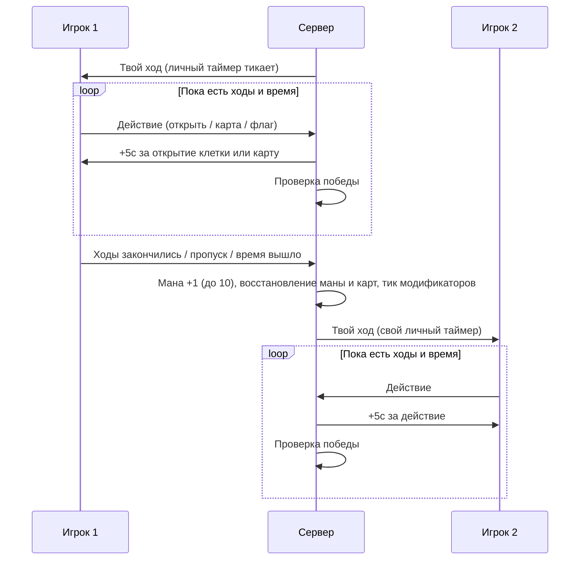

# TimeLimited

Основной PvP-режим: у каждого игрока свой банк времени на весь матч, действия его пополняют. Реализация — `backend/Game/GamePlay/Context/Rounds/TimeLimitedRound.cs`.

## Menu card

Player-facing copy for the mode-select card. Pixel font is wide — keep the title and tagline as-is; pick **short** or **long** body depending on how much room the card has.

| Field | Copy |
|-------|------|
| **Title** | Time Limited |
| **Tagline** | Every move buys time. |
| **Short** | 120 seconds for the whole match. Opens and cards refund +5s. Empty the bank, and you lose. |
| **Long** | Your clock is a bank of 120 seconds — it never resets between turns. Every cell you open and every card you play steals +5 seconds back from the fuse. Stall and the bank hits zero: match over. Play aggressive, bank the extra, and bury the other miner with their own time. |
| **At a glance** | 120s bank · +5s per open/card · timeout = loss |

### Icon

`64 × 64` item icon. Brass hourglass on a flat navy tile. One object, no scene.

PixelLab prompt and settings: [[mode-icons|Mode icons]] (icon + empty card frame).

## Параметры

| Параметр | Значение | Источник |
|----------|----------|----------|
| HP | 3 | `TimeLimitedModeOptions.PlayerHealth` |
| Ходов за раунд | 5 | `PlayerMoves` |
| Стартовая мана | 1 | `PlayerStartMana` |
| Потолок маны | 10 | `MaxManaCap` |
| Личное время | 120с | `RoundTime` |
| Бонус за действие | +5с | `TimeGainPerAction` |
| Стоимость карты в ходах | 0 | `CardMovesCost` |
| Рука / Колода | 5 / 10 | `PlayerConfigOptions` |
| Поле | 16x16, 40 мин | см. [[board]] |

## Механика времени

- В начале матча каждому игроку выдаётся **120 секунд** личного времени (`_secondsLeft[playerId]`).
- Время **не сбрасывается между раундами** — это общий банк на весь матч.
- Тикает только время активного игрока, по одной секунде, пока идёт его ход.
- За каждое **открытие клетки** (`Actions.CellOpened`) и **использование карты** (`Actions.CardUsed`) начисляется **+5 секунд**. Подписки живут только в пределах текущего раунда.
- Инкремент и декремент таймера сериализуются через семафор, чтобы бонус и тик не гонялись.
- Если банк времени игрока опустился до 0 — он проигрывает.
- Ход завершается по первому из двух условий: закончилось личное время или закончились ходы.

## Инициализация матча

1. Каждому игроку выставляются размер руки и размер колоды из `PlayerConfigOptions`.
2. Ожидание готовности игры (`IGameReadyAwaiter`).
3. Каждому игроку выдаётся `RoundTime` секунд личного времени.
4. Всем игрокам выставляются HP (max + current), максимальная мана = `PlayerStartMana` с полным восстановлением, максимум ходов = `PlayerMoves`.
5. Руки добираются до полного размера (`RoundPlayers.RestoreCards`).
6. Отправляется снапшот `GameStarted` + начальное состояние раунда.
7. Ожидание готовности обоих игроков (`IPlayersReadyAwaiter`).
8. Если один из игроков — бот, он назначается «текущим», чтобы первый ход достался живому игроку.

## Поток раунда



### Начало хода

- `player.Moves.Restore()` — ходы восстанавливаются до максимума.
- Оформляются подписки на `CellOpened` / `CardUsed` для начисления времени.
- Рассылается снапшот состояния раунда с новым `CurrentPlayer`.

### Конец хода

- Максимальная мана увеличивается на **+1**, пока не достигнет `MaxManaCap` (10).
- Мана восстанавливается до максимума.
- Рука добирается до полного размера; при пустой колоде в неё возвращаются карты из стэша.
- `IRoundActionService.Tick()` — тикают отложенные эффекты карт.
- Ходы игрока блокируются (`Moves.Lock`).
- Lifetime раунда терминируется — подписки на начисление времени снимаются.

### Пропуск хода

`SkipTurn()` терминирует lifetime раунда — счётчики времени и ходов прерываются, начинается фаза конца хода.

## Условия завершения

Проверяются перед каждым раундом (`IsGameOver`), победитель определяется в `GetWinner` в том же порядке приоритета:

1. HP любого игрока = 0 → побеждает оппонент. Обнуление HP также немедленно прерывает текущий раунд.
2. Игрок отключился → побеждает оппонент.
3. У игрока закончилось личное время (≤ 0) → побеждает оппонент.
4. Начиная со **второго раунда** — если на доске игрока все мины отмечены флагами и нет ложных флагов, он побеждает (`RoundPlayers.GetFlagWinner`).
5. Терминирован lifetime матча → игра заканчивается без победителя (`Guid.Empty`).

Причина победы логируется отдельно (`GetWinReason`): `health reached 0`, `disconnected`, `ran out of time`, `All opponent mines flagged`.

## Стратегия

Активная игра вознаграждается: пять действий за ход дают +25 секунд, что превышает типичные затраты на обдумывание. Пассивная игра проедает банк и ведёт к проигрышу по таймеру.

## Состояние раунда

`shared/Game/Context/TimeLimitedRoundState.cs`:

```
TimeLimitedRoundState:
  CurrentPlayer: Guid
  SecondsLeft: Dictionary<Guid, long>  // Персональный банк времени каждого
```

Клиентская сторона: `client/Assets/GamePlay/Sync/TimeLimitedRoundSnapshotHandler.cs`, `client/Assets/GamePlay/Loop/Context/TimeLimitedGameRound.cs`.

## Ключевые файлы

| Файл | Описание |
|------|----------|
| `backend/Game/GamePlay/Context/Rounds/TimeLimitedRound.cs` | Серверная реализация режима |
| `backend/Game/GamePlay/Context/Rounds/RoundPlayers.cs` | Добор карт и проверка победы по флагам |
| `shared/Configs/GameModeOptions.cs` | `TimeLimitedModeOptions` |
| `shared/Game/Context/TimeLimitedRoundState.cs` | Состояние раунда |
| `client/Assets/GamePlay/Loop/Context/TimeLimitedGameRound.cs` | Клиентская логика раунда |
| `backend/Game/Global/SessionFactory.cs` | Регистрация `IGameRound` по типу матча |

См. также: [[game-modes|Игровые режимы]], [[last-man-standing|LastManStanding]], [[match-flow|Цикл матча]].
