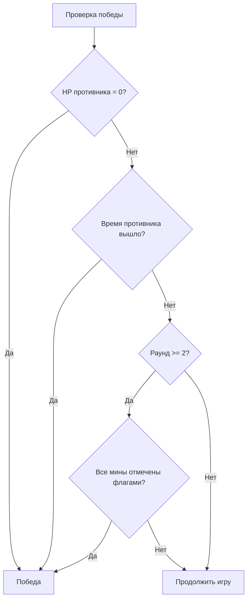

# Обзор игры

## Концепция

Mines Leader — competitive multiplayer minesweeper. Два игрока одновременно играют на своих минных полях 16x16. Цель — уничтожить противника, используя классическую механику сапёра в сочетании с карточной системой.

## Ключевые концепции

### Минное поле
Каждый игрок имеет своё поле 16x16 (256 клеток) с 40 минами. Мины размещаются случайно после первого клика (первый клик всегда безопасен). Клетки бывают:
- **Taken** (закрытая) — не открыта, может содержать мину, может быть помечена флагом
- **Free** (открытая) — показывает число мин вокруг, безопасна

### Здоровье (HP)
Начальное HP: **3**. Снижается на 1 за каждую подорванную мину. При HP = 0 игрок проигрывает.

### Ходы (Moves)
Каждый ход даёт **5 действий**. Действие — открытие клетки или использование карты. Установка/снятие флага не тратит действие.

### Мана
Ресурс для карт. Начальная мана: **1**, увеличивается на 1 каждый ход. Полностью восстанавливается в начале хода.

### Карты
10 уникальных карт с разными эффектами. Рука — до 5 карт. Колода — 10 карт, циклически пополняется из сброса. Подробнее: [[cards|Карточки]].

### Флаги
Игрок помечает клетки флагами, чтобы обозначить предполагаемые мины. Правильная пометка всех оставшихся мин (после 2+ раундов) — одно из условий победы. Подорванные мины поле уже покинули и на эту проверку не влияют; при HP = 0 игрок проигрывает отдельно.

## Условия победы

1. **Урон** — снизить HP противника до 0
2. **Таймаут** — время противника истекло (только PvP)
3. **Флаги** — правильно отметить все мины на поле (после 2+ раундов)
4. **Дисконнект** — противник отключился

## Персонажи

Четыре игровых персонажа: `BOMJ`, `BIBA`, `BOBA`, `CHENOSOS`.

## См. также
- [[game-modes|Игровые режимы]] — правила каждого режима
- [[match-flow|Цикл матча]] — полный поток от поиска до результата
- [[cards|Карточки]] — все карты и их эффекты
